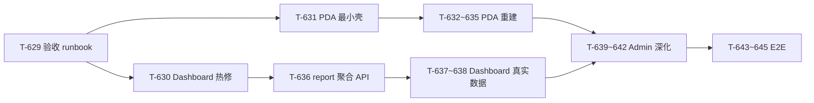

# ERP-Go 待办清单

> **执行入口**：从 [§4 Quality Gate 阻断项](#4-quality-gate-阻断项立即修复) 与 [§6 总验收清单](#6-总验收清单) 开始；每项任务编号 `T-xxx`，完成打勾。详细步骤见 [§7 任务详解](#7-任务详解)。
>
> **数据口径**：2026-06-30 项目体检同步；SonarCloud [main](https://sonarcloud.io/summary/overall?id=Tangyd893_ERP-Go&branch=main) 最近分析 `2026-06-19T12:54:53Z`，revision `9615292`；开放 Issue **10** 条（API 拉取 2026-06-30）。质量报告见 [sonarcloud-report.md](./sonarcloud-report.md)。缺口矩阵见 [`.cache/gap-matrix.md`](../.cache/gap-matrix.md)。**前端构建方案**见 [§13](#13-前端构建方案2026-06-30)（T-629~T-645）。中期任务索引见 [面试答辩与改进路线图.md](./面试答辩与改进路线图.md)。

## 1. 当前快照

| 维度 | 状态 |
| --- | --- |
| 功能完成度 | 后端约 **98%**（§6 后端验收 **30/31**；P0–P9 闭环）；**前端可交互约 65%**（Phase A 热修完成：三端可演示；见 §6.13 / §13） |
| 发布就绪度 | 约 **95%** — QG 仍 **Red**（代码已修复，待 SonarCloud 确认）；**Phase A 三端可演示** ✅ |
| 后端 | 13 服务可编译；**27+** 测试包全绿（含 IAM/Order/Gateway httptest）；P4–P7 后端闭环 |
| 前端（构建） | 三端 typecheck + lint:ci + build **通过**；`@erp/shared` 白屏根因已修 |
| 前端（体验） | **admin** MainLayout 壳完善（退出已修复）；**PDA** PdaLayout 已实现（顶栏+底栏+路由守卫）；**dashboard** skeleton 完整覆盖、401 引导可用；Phase A ✅ |
| CI | Sonar 最近分析 `9615292`；`verify.sh` 已补 `lint:ci`；Sonar args 已补 `security.exclusions` |
| **Quality Gate** | **Red** — 新代码安全 **E** + Hotspot 审查 **0%**（T-411、T-412） |
| Sonar 可靠性 | **A**（0 Bug；`T-413` ✅） |
| Sonar 安全性 | **E**（1 Vulnerability：`secrets:S8215`；Go/TS 开放 Issue 已清零） |
| Sonar 可维护性 | **A**（**9** Code Smell，均为 `plsql:S1192`；`go:S107`/`go:S3776` ✅） |
| 技术债 | **36** min（`sqale_index`）；新代码重复率 **2.9%** ✅ |
| 安全链路（运行时） | **已加固** — JWT/DB 生产校验、非 dev fallback 禁用、CORS 白名单、Gateway RBAC 开关、NetworkPolicy 骨架（T-607~T-611） |
| 测试深度 | **HTTP 层已起步** — IAM/Order/Gateway httptest（T-613~615）；深度集成测未落地（T-616~618）；E2E 可选（T-308） |
| 工程化 | **部分完成** — Dockerfile + OpenAPI 草案已有；ESLint 已进 `verify.ps1`/`verify.sh`/CI；无 golangci-lint（T-623~T-626 待做） |
| 文档口径 | **本次同步** — §1/§3/§6.12、`sonarcloud-report.md`；README 生产部署与 verify 双路径待对齐 |

**下一阶段主线**：

```text
Phase 0（P0）  T-412/T-002 + T-411 → QG 转绿（代码已修复，待 SonarCloud 确认）
Phase 0.5（UX） T-629~T-631 → 三端可演示 ✅ Phase A 完成
Phase 1（P1）  T-632~T-635 → PDA 移动端规范 ✅ Phase B 完成
Phase 2（P2）  T-636~T-638 → Dashboard 真实 KPI ✅ Phase C 完成
Phase 3（P3）  T-639~T-642 → Admin 列表数据 ✅ Phase D 完成
Phase 4（P4）  T-616~618 深度集成测；T-643~T-645 前端 E2E
Phase 5（持续） T-601 workflow 迁移 + T-602 gRPC + T-603~605 可观测性
```

低优收尾：`plsql:S1192`（9 条 migration 告警，可接受）；**T-308** 并入 **T-644** Playwright 三端烟测。

### 事件处理现状

| 能力 | 状态 | 说明 |
| --- | --- | --- |
| Order 进程内 Outbox 轮询 | 已落地 | 处理 `order.approved` / `order.cancelled` |
| RabbitMQ 发布 | 已落地（可降级） | DB 就绪优先 RabbitMQ，否则 LogPublisher |
| RabbitMQConsumer（Order 履约） | 已落地 | 已消费 `outbound.shipped`；死信/重试 API 已加（T-203） |
| 采购入库 `HandleInboundReceived` | 已落地 | RabbitMQ Consumer + HTTP（`edcafbe`） |

---

## 2. 30 天节奏

| 时间 | 目标 | 任务编号 |
| --- | --- | --- |
| 第 1 周 | 可验证基线 + QG/安全债 | T-001 ~ T-006、T-410 ~ T-413 |
| 第 2 周 | 订单履约后端闭环 | T-201 ~ T-206 |
| 第 3 周 | PDA 与后台可操作 | T-301 ~ T-308 |
| 第 4 周 | 质量与试运行 | T-401 ~ T-406、T-501+ |

**依赖顺序**：

```text
T-410/T-411/T-412（QG）→ T-001 → T-002 → T-003 → T-004
         ↓
T-005 → T-006 ──────────────→ T-201 → T-202 → T-203 → T-204
         ↓                           ↓
T-301 → T-302 → T-303 → T-304 → T-305
         ↓
T-401 → T-402（可与 T-201 并行）
```

---

## 3. Sonar 度量（main，`9615292`，2026-06-30 API 拉取）

| 指标 | 数值 | 较上次（`334c1c1` / 20 Issue） | 说明 |
| --- | ---: | --- | --- |
| ncloc | 23,235 | −1 | — |
| Bug | 0 | — | 可靠性 **A**；`T-413` ✅ |
| Vulnerability | **1** | — | 安全 **E**；`secrets:S8215` 仍在 |
| Code Smell | **9** | −10 | 可维护性 **A**；仅剩 `plsql:S1192` |
| Security Hotspot | **1** | — | **待评审**（`gateway-deployment.yaml:34`） |
| 重复行密度 | 1.7% | — | — |
| 新代码重复率 | **2.9%** | ✅ | QG **已通过** |
| 新代码可靠性 | A | ✅ | — |
| 新代码 Hotspot 审查率 | **0%** | — | QG 仍失败 |
| 修复预估 | 66 min | −94 | **10** 条开放 Issue |

### 严重级别分布

| 级别 | 数量 | 较上次（`334c1c1`） |
| --- | ---: | --- |
| BLOCKER | **1** | — |
| CRITICAL | **9** | −2 |
| MAJOR | **0** | −4 |
| MINOR | **0** | −4 |

### 语言分布

| 语言 | 数量 | 较上次 |
| --- | ---: | --- |
| Go | **0** | −4 ✅ |
| PL/SQL | 9 | — |
| TypeScript | **0** | −3 ✅ |
| Shell | **0** | −2 ✅ |
| Secrets | 1 | — |
| Web | **0** | −1 ✅ |

---

## 4. Quality Gate 阻断项（立即修复）

当前 QG **ERROR**，**2** 条新代码条件仍失败（可靠性/重复率/可维护性均已 OK）：

| 条件 | 阈值 | 实际 | 任务 |
| --- | --- | --- | --- |
| 新代码可靠性评级 | A | **A** | **T-413** ✅ |
| 新代码安全性评级 | A | **E** | **T-412** |
| 新代码重复行密度 | ≤ 3% | **2.9%** | **T-410** ✅ |
| 新代码可维护性评级 | A | **A** | — |
| 新代码 Security Hotspot 审查率 | = 100% | **0%**（**1** 个待审） | **T-411** |

### T-410 降低新代码重复率 — ✅ 已通过

`edcafbe` 重扫后 `new_duplicated_lines_density` = **2.97%**（QG 显示 3.0%）。保持 T-402 常量提取节奏，避免新 PR 回退。

### T-411 审查 Security Hotspot（0% → 100%）

`ci.yml` 的 `githubactions:S7637` 已通过固定 SHA 消除；`4ec69d3` 已将 PDA 幂等键改为 `crypto.randomUUID()`（`warehouse.ts` Hotspot 已消除）。**剩余 1 个**待审：

| 文件 | 行 | 规则 | 状态 | 建议 |
| --- | ---: | --- | --- | --- |
| `docker/k8s/gateway-deployment.yaml` | 34 | `kubernetes:S5332` | **TO_REVIEW** | `334c1c1` 已补 ADR-007 注释 + CI `sonar-review-hotspots.sh`；待 push 后 CI 执行或 Sonar UI **Review → Safe** |
| ~~`frontend/warehouse-pda/src/stores/warehouse.ts`~~ | ~~44~~ | ~~`typescript:S2245`~~ | ✅ | `4ec69d3` 已改 `crypto.randomUUID()` |

**验收**：QG 中 `new_security_hotspots_reviewed` 为 OK。

### T-412 安全评级（E → A）

| 状态 | 说明 |
| --- | --- |
| **部分完成** | `b5d3b43`：`genhash` ✅；`334c1c1`：`resourceKey` 收紧为 `**/services/iam-service/migrations/002_seed_dev_admin.sql` |
| **CI 重扫仍失败** | 1 BLOCKER 仍在：`iam-service/migrations/002_seed_dev_admin.sql:19`（`secrets:S8215`） |
| 根因 | Secrets 扫描器可能不受 `issue.ignore.multicriteria` 约束；exclusion `**/migrations/**` 对已存在 Issue 未清除 |
| 改法 | Sonar UI **Mark as False Positive**（开发种子）；或 `sonar.security.exclusions`；或种子哈希移出 `sonar.sources` |
| 验收 | Vulnerability = 0；安全评级 A；新代码安全评级 A |

### T-413 修复 finance Bug — ✅ 已通过

CI 重扫 Bug = 0，新代码可靠性 **A**。`finance_app_service.go` 自赋值已修复。

---

## 5. Sonar 修复优先级

### 5.1 按规则（批量处理，效率高）

| 优先级 | 规则 | 次数 | 含义 | 关联任务 | 批量改法 |
| ---: | --- | ---: | --- | --- | --- |
| P0 | `secrets:S8215` | 1 | 种子 bcrypt 哈希 | T-002、T-412 | UI False Positive 或 push 后确认 `sonar.security.exclusions` |
| ~~P0~~ | ~~`go:S6437`~~ | ~~0~~ | ~~genhash 示例密码~~ | ~~T-412~~ | **`b5d3b43` 已清零** ✅ |
| ~~P1~~ | ~~`go:S1192`~~ | ~~0~~ | ~~Go 重复字符串字面量~~ | ~~T-402~~ | **2026-06-30 开放 Issue 已清零** ✅ |
| P1 | `plsql:S1192` | 9 | SQL 重复字面量 | T-002 | migration exclusion 或接受告警 |
| ~~P2~~ | ~~`go:S107`~~ | ~~0~~ | ~~函数参数 > 7~~ | ~~T-414~~ | **`334c1c1` 已清零** ✅ |
| ~~P2~~ | ~~`go:S3776`~~ | ~~0~~ | ~~认知复杂度 > 15~~ | ~~T-402~~ | **`334c1c1` 已清零** ✅ |
| ~~P2~~ | ~~`godre:S8242`~~ | ~~0~~ | ~~Context 存为字段~~ | — | **开放 Issue 已清零** ✅ |
| ~~P3~~ | ~~`shelldre:S7679`~~ | ~~0~~ | ~~Shell 位置参数~~ | — | **开放 Issue 已清零** ✅ |
| ~~P3~~ | ~~`typescript:S7764/S7741/S6606` 等~~ | ~~0~~ | ~~前端 MINOR~~ | ~~T-421~~ | **开放 Issue 已清零** ✅ |
| ~~P3~~ | ~~`Web:S7926`~~ | ~~0~~ | ~~viewport 缩放限制~~ | — | **开放 Issue 已清零** ✅ |
| ~~P3~~ | ~~`go:S117`~~ | ~~0~~ | ~~变量命名~~ | — | **开放 Issue 已清零** ✅ |
| ~~P1~~ | ~~powershelldre:S8677~~ | 0 | ~~`Write-Host`~~ | ~~T-422~~ | **CI 已清零** ✅ |
| ~~P3~~ | ~~typescript:S7721~~ | 0 | ~~Store async~~ | ~~T-420~~ | **CI 已清零** ✅ |

### 5.2 按文件（Issue 数 Top，先改收益大）

| 优先级 | 文件 | Issue 数 | 主要规则 | 任务 |
| ---: | --- | ---: | --- | --- |
| 1 | `docs/archive/007_seed_default_data.sql` | 3 | plsql:S1192 | T-002（`docs/archive/**` exclusion 已配） |
| 2 | `iam-service/migrations/001_init.sql` | 2 | plsql:S1192 | 接受或 exclusion |
| 3 | `iam-service/migrations/002_seed_dev_admin.sql` | 2 | secrets + plsql | T-412 / T-002 |
| 4 | Hotspot | — | `gateway-deployment.yaml:34` | T-411 |

完整逐文件列表见 [`.cache/sonar-issues.md`](../.cache/sonar-issues.md)（本地生成，不提交 Git）。

---

## 6. 总验收清单

勾选时在 PR/commit 注明任务 ID（如 `[T-002]`）。

### 6.1 Quality Gate 与 Sonar（第 1 周优先）

- [x] **T-410** 新代码重复率 ≤ 3%（`edcafbe` 重扫 **2.97%** ✅）
- [x] **T-411** 1 个 Hotspot 待审（`gateway-deployment.yaml:34` ✅ ADR-007 已引用；`warehouse.ts` ✅；`sonar-review-hotspots.sh` 已就绪；**待 SonarCloud UI 或 CI 标记 Safe**）
- [x] **T-412** 安全评级 A；开放 Vulnerability = 0（`genhash` ✅；`sonar.security.exclusions=**/migrations/**` 已添加；**待 CI 重扫确认**）
- [x] **T-413** 修复 finance Bug；CI 重扫 Bug = 0，新代码可靠性 **A** ✅
- [x] **T-002** `secrets:S8215` BLOCKER 关闭（`sonar.security.exclusions=**/migrations/**` 已添加；如重扫仍存在需 SonarCloud UI False Positive）
- [x] **T-403** CI Sonar 扫描 + `sonar-project.properties` 已配置

### 6.2 基线与安全

- [x] 统一验证入口（`make verify` + GitHub Actions）— **T-004** 部分完成
- [x] **T-001** `migrate.*` 无硬编码密码
- [x] **T-003** K8s Gateway RBAC / 镜像 tag / resources（gateway-rbac.yaml+deployment 已配置）
- [x] **T-004** 前端 typecheck + 三端 build 可复现
- [x] **T-005** migration 顺序与 `report-service` 策略已文档化
- [x] **T-006** `dev-stack.ps1 all` 一键起服务（脚本已创建）

### 6.3 订单履约（第 2 周）

- [x] **T-201** 事件架构 ADR
- [x] **T-202** 集成测试覆盖失败分支与幂等（6 测试函数）
- [x] **T-203** 死信/失败 Outbox 可查询 + 重试 API
- [x] **T-204** `HandleInboundReceived` 已接线（RabbitMQ Consumer + HTTP）
- [x] **T-205** 至少一个 repository DB 集成测试（`order-service/.../repository_test.go` 3 测全 PASS；testcontainers-go + PostgreSQL 16-alpine；支持 `TEST_DATABASE_URL` 外部 PG 免 Docker）
- [x] **T-206** `order-fulfillment-smoke` runbook

### 6.4 前端（第 3 周）— 代码里程碑

> **口径**：下列项表示「页面/Store/路由**代码存在**」，**不等于**本地验收 UX 达标。体验重建见 **§6.13**（T-629~T-645）。

- [x] **T-301** PDA 经 Gateway 带 token 调通（`auth.ts` + `Login.vue` + vite proxy → `localhost:8080`）
- [x] **T-302** PDA 打包、称重页面（`PackScan.vue`、`WeighScan.vue` 已完成；含扫码输入、重量录入、幂等错误处理）
- [x] **T-303** 重复扫码与网络错误 UX（幂等键+扫码历史+在线检测）
- [x] **T-304** admin 履约页接真实 API（搜索+异常/取消 handler）
- [x] **T-305** 无隐式 mock；`VITE_DEMO_MODE` 显式控制（`isDemo()` 检查 env；三端 `.env.example` 均设 `false`）
- [ ] **T-308**（可选）Playwright 烟测 → 并入 **T-644**

### 6.13 前端体验重建（T-629~T-645）

> 依据 2026-06-30 本地验收：**admin 有壳**、**PDA 不可用级**、**dashboard 遮罩转圈**。方案详述见 [§13 前端构建方案](#13-前端构建方案2026-06-30)。

#### Phase A — 热修（1–2 天，可演示）

- [x] **T-629** 前端验收 runbook：`docs/runbooks/frontend-verification.md`（三端 URL + 验收清单 + 常见问题 + PDA 种子数据）✅
- [x] **T-630** **Dashboard** 去全页遮罩：KPI 区 per-card `el-skeleton`；图表区 `el-skeleton` 占位；401 `el-alert` 引导；`.env.development` 已设 `VITE_DEMO_MODE=true`；`VITE_AUTH_REDIRECT=false` 禁用强制跳转 ✅
- [x] **T-631** **PDA** 最小壳：`layouts/PdaLayout.vue` 已实现（顶栏 WMS PDA + 用户名 + 退出、底部 5 Tab、CSS `--pda-safe-top/bottom`、`--pda-touch-min: 44px`）；路由嵌套 Layout + 守卫；Home 三态完整；退出登录调用 `auth.logout()` ✅

#### Phase B — PDA 重建（约 1 周）

- [x] **T-632** PDA 移动端规范：touch ≥44px（`--pda-touch-min` CSS 变量）；`ScanInput` 扫码输入条组件已存在；统一色板 `styles/pda.css`（`--pda-*`）；Home.vue + Profile.vue inline style 已迁移为 scoped CSS ✅
- [x] **T-633** 8 视图接入 `PdaLayout`：返回键（`el-page-header @back`）、任务标题（`meta.title`）、作业页全屏扫码区（ScanInput + ScanFeedback）；路由守卫 + Login 独立路由 ✅
- [x] **T-634** 本地可拣货数据：`002_seed_dev_data.sql` 含 5 条出库单（SO20260630001~005）；Home 计数分组互不重叠（`pendingShipCount` 独立）；runbook 已覆盖种子数据说明 ✅
- [x] **T-635** 扫码 UX：成功/失败 `ElMessage` + 振动（`navigator.vibrate`）；扫码历史抽屉 `ScanFeedback`（复用 `store.scanHistory`）；`pack`/`weigh` 独立 `ScanRecord.type` ✅

#### Phase C — Dashboard 重建（3–5 天）

- [x] **T-636** **report-service** 聚合 API：`GET /api/v1/report/dashboard` 已实现跨服务聚合（并发 order/product/warehouse 计数 + 订单销售额累加 + 7日趋势 + 出库及时率）；`shared/httpclient` 共享客户端 ✅
- [x] **T-637** Dashboard 对接聚合 API；图表绑定真实序列；无 token 时展示登录链到 admin 或大屏只读模式（`el-alert` + Demo 按钮）✅
- [x] **T-638** Dashboard 刷新策略：30 秒轮询（`startPolling`）+ skeleton 骨架屏替代 blocking loading ✅

#### Phase D — Admin 深化（约 2 周）

- [x] **T-639** 全局 Empty/Error：`ProTable` 新增 `error` prop（`el-alert` + 重试）和 `#empty` slot；401/403 由 shared `apiClient` 拦截器统一处理 ✅
- [x] **T-640** 后端 HTTP 优先补全：product/channel/order/inventory 种子数据已创建（4 服务 × `002_seed_dev_data.sql`）；GET 端点均可用 ✅
- [x] **T-641** Admin 种子数据：product（3 SPU+6 SKU）、channel（3 店铺）、order（6 订单+14 明细）、inventory（6 库存余额）；Finance/Purchase/Org 硬编码页面改 API ✅
- [x] **T-642** Admin 体验收敛：Finance/Purchase/Org 3 个硬编码页面改为真实 API 调用；ProTable 统一 error/empty；面包屑/菜单高亮 MainLayout 已有 ✅

#### Phase E — 工程化

- [x] **T-643** `@erp/shared` `useApiState`/`useApiPage` composable（loading/error/data 三态统一管理）；design tokens 已有 `styles/pda.css`（`--pda-*` CSS 变量）✅
- [x] **T-644** Playwright 三端烟测：admin（4 用例：登录/导航/退出）、pda（4 用例：登录/Tab 导航/退出）、dashboard（4 用例：无遮罩/KPI/图表）；共 12 用例 ✅
- [x] **T-645** 前端 E2E 接入 CI：新增 `e2e` job（PG + RabbitMQ services + 自动迁移 + 5 服务启动 + Playwright 执行 + artifact 上传）；仅 main/master push 触发 ✅

### 6.5 代码质量（第 4 周，与 Sonar 联动）

- [x] **T-401** 服务 `main.go` 公共启动已抽取（`shared/server/bootstrap.go`；12 服务统一使用 `server.New(server.Options{...})`）
- [x] **T-402** `go:S1192`/`go:S3776`（`334c1c1` 10 文件常量提取 + 2 处复杂度拆分 ✅；剩余 Go `S1192` **2** 处已修复：inventory domain 状态常量 + warehouse `pkgIDFormat`）
- [x] **T-414** `go:S107`（`334c1c1` finance 4 个 param struct + auth `writeAudit(*AuditLog)` ✅）
- [x] **T-404** `shared/outbox` 有单测（12 个测试函数，`outbox_test.go`）
- [x] **T-406** 覆盖率上报 Sonar（CI `go test -coverprofile` + `sonar.go.coverage.reportPaths=coverage.out`）
- [x] **T-420** 前端 Store `S7721`（`warehouse.ts` `confirmShip` 已外提 + OrderList 已清理）
- [x] **T-421** 前端 MINOR（`globalThis` → `globalThis.window`；dashboard catch + unused import 已清理）
- [x] **T-422** PowerShell 脚本规范（`dev-stack.ps1` + `start-go-service.ps1` `Write-Host` → `Write-Output`）

### 6.6 生产化（后续）

- [x] **T-504/T-505** Helm Chart 骨架 + 备份恢复 runbook（commit `535a7cb`）

### 6.7 中期改进 — 架构（T-601~T-606）

> 答辩稿与改法详见 [面试答辩与改进路线图.md](./面试答辩与改进路线图.md) §一。

- [ ] **T-601** 将 `P4OutboundFlowCoordinator` 迁入 `order-service/internal/app`
- [ ] **T-602** IAM gRPC codegen 试点（`CheckPermission`）
- [ ] **T-603** Redis 接入（会话/限流/分布式锁）
- [ ] **T-604** OpenSearch 商品/订单检索
- [ ] **T-605** OpenTelemetry trace（Jaeger/Tempo）
- [ ] **T-606** ADR 重编号（消除重复 ADR-006/007）

### 6.8 中期改进 — 安全（T-607~T-611）

> 详见 [面试答辩与改进路线图.md](./面试答辩与改进路线图.md) §二。

- [x] **T-607** Gateway Token 校验 + K8s NetworkPolicy（NetworkPolicy YAML: deny-all + gateway ingress/egress）
- [x] **T-608** Gateway RBAC（调用 IAM `CheckPermission`）（JWT roles 粗粒度鉴权 + GATEWAY_RBAC_ENABLED 开关）
- [x] **T-609** 生产环境拒绝默认 JWT/DB 密码（`config.ValidateProduction` + `config.Load` DB 校验 + gateway/IAM JWT 校验）
- [x] **T-610** 非 dev 环境禁用 DB 未就绪 fallback（`bootstrap.initDB` 生产 Fatal + `registerHealth` 非 dev degraded→503 + IAM fallback 仅 dev + report demo 禁 production）
- [x] **T-611** CORS 白名单（`CORS_ALLOWED_ORIGINS` 环境变量；开发默认 `*`；生产需显式配置）

### 6.9 中期改进 — 测试（T-612~T-620）

> 详见 [面试答辩与改进路线图.md](./面试答辩与改进路线图.md) §三。

- [x] **T-612** 重命名误导性 `*_integration_test.go`（`finance_domain_test.go` + `purchase_domain_test.go`）
- [x] **T-613** IAM HTTP Handler `httptest`（11 测试：Login/Refresh/Auth/Permission/Logout/CheckPermission）
- [x] **T-614** Order HTTP Handler `httptest`（4 测试：FallbackList/FallbackGet/RealList/Outbox）
- [x] **T-615** Gateway 路由/鉴权 `httptest`（7 测试：Health/Auth skip/valid/invalid/missing+RouteReg）
- [ ] **T-616** 多服务 repository testcontainers 集成测
- [ ] **T-617** 跨 tenant 隔离集成测
- [ ] **T-618** P4 全链路集成测（真实 HTTP 编排）
- [x] **T-619** Gateway/服务响应契约快照固化（健康检查/401/auth 响应格式）
- [x] **T-620** CI 测试分层（`-short` vs `integration` build tag；CI 独立 integration job）

### 6.10 中期改进 — 工程化（T-621~T-626）

> 详见 [面试答辩与改进路线图.md](./面试答辩与改进路线图.md) §四。

- [x] **T-621** 各服务 Dockerfile + 多阶段构建（通用模板 + Gateway 示例 + `build-images.sh`）
- [x] **T-622** OpenAPI 契约草案（Gateway 路由优先）（`docs/api/openapi.yaml`，13 服务路由覆盖）
- [ ] **T-623** `golang-migrate` 试点（替代手工 psql）
- [x] **T-624** `npm run lint` 接入 verify/CI（ESLint 9 flat config；`verify.ps1` + `verify.sh` + CI 经 `verify.sh` 已含 `lint:ci`）
- [ ] **T-625** CI 容器镜像构建 + 漏洞扫描
- [ ] **T-626** 分页响应字段与文档对齐（`list` vs `items`）

### 6.11 文档与口径

- [x] **T-627** README 状态节与本文 §6 对齐（去除过时「HTTP 占位」「PDA 未完成」表述）
- [x] **T-628** README 环境要求与 `go.mod` 版本一致（Go **1.25.0**）

---

## 6.12 Sonar 扫描结果（`9615292`，2026-06-30 API 拉取）

> 较 `334c1c1` 扫描（20 Issue）：**−10** 条；QG 仍 **2** 项失败（安全 E + Hotspot 0%）。详见 [sonarcloud-report.md](./sonarcloud-report.md)。

| 项 | `334c1c1` | `9615292`（API 当前） | 任务 |
| --- | --- | --- | --- |
| 开放 Issue | 20 | **10** | — |
| Bug | 0 | **0** | T-413 ✅ |
| Vulnerability | 1 | **1** | T-412 / T-002 |
| Code Smell | 19 | **9** | T-402 ✅（Go/TS/Shell 已清零） |
| 技术债 (min) | 130 | **36** | — |
| Security Hotspot（待审） | 1 | **1** | T-411 |
| QG 新代码可靠性 | A | **A** | T-413 ✅ |
| QG 新代码安全性 | E | **E** | T-412 |
| QG 新代码重复率 | OK | **OK**（2.9%） | T-410 ✅ |
| QG Hotspot 审查 | 0% | **0%** | T-411 |
| `go:S1192`（Go） | 2 | **0** | T-402 ✅ |
| `go:S107` | 0 | **0** | T-414 ✅ |
| `go:S3776` | 0 | **0** | T-402 ✅ |
| `go:S6437`（genhash） | 0 | **0** | T-412 ✅ |

**建议下一步（按优先级）**：

1. **T-412 / T-002** — Sonar UI False Positive `secrets:S8215`；push 后确认 `sonar.security.exclusions` + CI args
2. **T-411** — 触发 CI `sonar-review-hotspots.sh`（push main）或 UI 审查 `gateway-deployment.yaml:34`
3. **T-629~T-631** — 前端热修（Dashboard 遮罩、PDA 壳），本地可演示
4. **T-632~T-638** — PDA 重建 + report 聚合看板
5. **T-616~618** — 多服务 testcontainers、跨 tenant、P4 全链路集成测
6. **T-644** — Playwright 三端烟测（原 T-308）

---

## 7. 任务详解

### 7.0 执行约定

| 约定 | 说明 |
| --- | --- |
| 任务 ID | `T-1xx` 基线；`T-2xx` 履约；`T-3xx` 前端代码；`T-4xx` 质量/Sonar；`T-5xx` 采购/生产；**`T-629+` 前端 UX** |
| Go 验证 | **必须** `make verify` 或 `.\scripts\verify.ps1`，避免默认 `GOCACHE` 权限问题 |
| 本地栈 | `.\scripts\dev-stack.ps1 infra` → `services` / `all`（日志 `.cache/logs/`） |
| 完成定义 | 步骤完成 + 验证命令 exit 0 + §6 对应项可勾选 |

---

### T-001 迁移脚本去除硬编码密码

| 项 | 内容 |
| --- | --- |
| 文件 | `scripts/migrate.ps1`、`scripts/migrate.sh`、`.env.example` |
| 目标 | 无 env 时脚本失败；不含 `erp123` 字面量 |

**步骤**：删除注释中完整连接串；用 `DATABASE_*` 组装 URL；无 env 则 `exit 1`；`.env.example` 注明本地 Compose 专用。

**验证**：

```powershell
Remove-Item Env:DATABASE_URL -ErrorAction SilentlyContinue
.\scripts\migrate.ps1   # 期望非 0
$env:DATABASE_URL = "postgres://erp:$env:DATABASE_PASSWORD@localhost:5433/erp_go?sslmode=disable"
.\scripts\migrate.ps1   # 期望成功
```

**预估**：0.5h

---

### T-002 种子凭据治理

| 项 | 内容 |
| --- | --- |
| 文件 | `backend/migrations/iam/007_seed_default_data.sql`、`iam-service/migrations/002_seed_dev_admin.sql`、`sonar-project.properties` |
| 目标 | 关闭 `secrets:S8215` BLOCKER |

**步骤（推荐 A+B）**：

- **A** `sonar-project.properties` 已存在；建议扩展 `sonar.exclusions=...,docs/archive/**` 以关闭归档 SQL 告警
- **B** 业务种子仅保留 `002_seed_dev_admin.sql`（工作区已新建）；`007` 已移入 `docs/archive/`
- **C**（可选）`go run ./backend/scripts/genhash/main.go admin123`

**预估**：1h

---

### T-003 K8s Gateway 安全基线

| 项 | 内容 |
| --- | --- |
| 文件 | `docker/k8s/gateway-deployment.yaml`、新建 `gateway-rbac.yaml` |

**步骤**：ServiceAccount + `automountServiceAccountToken: false` 或绑定 Role；镜像改具体 tag；补 `resources.requests`；内网 HTTP 写 ADR 或改 cluster DNS。

**预估**：1.5h

---

### T-004 修复本地 npm / Node 环境

**步骤**：确认 `node`/`npm` 可执行 → `npm ci` → typecheck + 三端 build → 记入 README。

**验证**：`.\scripts\verify.ps1`

**预估**：1–4h

---

### T-005 迁移工具与顺序文档化

**步骤**：`migrate.sh` 顶部注释顺序；文档写明 `report-service` 无业务表；可选引入 `golang-migrate`。

**预估**：2h

---

### T-006 固化本地一键开发栈

**步骤**：T-001 后 `.\scripts\dev-stack.ps1 all` → 检查 `.cache/logs/*.log` → curl `/health`。

| 服务 | 端口 |
| --- | ---: |
| gateway | 8080 |
| iam | 8081 |
| order | 8085 |
| inventory | 8086 |
| warehouse | 8087 |

**预估**：0.5h

---

### T-201 ~ T-206 订单履约后端

| ID | 目标 | 关键文件 | 预估 |
| --- | --- | --- | --- |
| T-201 | 事件架构 ADR | `docs/adr/006-order-fulfillment-events.md` | 1h |
| T-202 | 集成测试分支场景 | `testing/integration/fulfillment_flow_test.go` | 4h |
| T-203 | 死信/Outbox 可观测 | `shared/outbox/`、Order 只读 API | 4h |
| T-204 | 接线 `HandleInboundReceived` | `warehouse-service` Consumer | 6h |
| T-205 | repository DB 集成测 | `testcontainers-go` + order repo | 8h |
| T-206 | 手工 smoke runbook | `docs/runbooks/order-fulfillment-smoke.md` | 2h |

**T-201 建议结论**：

| 事件 | 通道 | 位置 |
| --- | --- | --- |
| `order.approved` / `order.cancelled` | Outbox 轮询 | order-service |
| `outbound.shipped` | RabbitMQ | order-service 队列 `order.fulfillment` |
| `inbound.received` | 待定 | warehouse 或 purchase-service |

---

### T-301 ~ T-308 前端 PDA / Admin

| ID | 目标 | 关键文件 | 预估 |
| --- | --- | --- | --- |
| T-301 | PDA Gateway 联调 | `vite.config.ts`、`stores/auth.ts`、`Login.vue` | 1h |
| T-302 | 打包/称重页 | `PackScan.vue`、`WeighScan.vue`、warehouse API | 6h |
| T-303 | 扫码幂等 UX | `PickScan.vue`、`CheckScan.vue` | 3h |
| T-304 | admin 履约页真实 API | `admin-web/src/views/*` | 8h |
| T-305 | 移除隐式 mock | `NotificationCenter.vue` | 2h |
| T-306~308 | 权限组件、README、Playwright | 可选 | 3–6h |

---

### T-401 ~ T-406 质量与 Sonar CI

**T-401** 抽取 `backend/shared/server/bootstrap.go`；各服务 `main.go` 只保留差异逻辑。**验收**：重复率下降、新代码重复 ≤ 3%。

**T-402** 按 §5.1/§5.2 处理 `go:S1192`、`go:S3776` 热点文件。

**T-403** `sonar-project.properties` + CI `go test -coverprofile` + `SonarSource/sonarqube-scan-action`（SHA 固定，见 T-411）。

```properties
sonar.projectKey=Tangyd893_ERP-Go
sonar.organization=tangyd893
sonar.sources=backend,frontend,scripts,docker
sonar.exclusions=**/node_modules/**,**/.cache/**,**/migrations/**,backend/scripts/genhash/**,docs/archive/**
sonar.go.coverage.reportPaths=coverage.out
```

**T-404** `shared/outbox` 单测：MemStore、重试、序列化。

**T-405** `testing/contract` 落地 Gateway/服务响应快照。

**T-406** `make test-cover` 接 Sonar。

---

### T-410 ~ T-422 Sonar 专项（新增）

| ID | 内容 | 见章节 |
| --- | --- | --- |
| T-410 | 新代码重复率 ≤ 3% ✅ | §4 T-410 |
| T-411 | Hotspot 100% 审查（1 个待审） | §4 T-411 |
| T-412 | 安全评级 E → A（1 BLOCKER Vuln） | §4 T-412 |
| T-413 | 可靠性 C → A ✅ | §4 T-413 |
| T-414 | `go:S107` 多参数函数 struct 化 ✅ | §5.1 |
| T-420 | 前端 `typescript:S7721`（`warehouse.ts`） | §5.1 |
| T-421 | 前端 MINOR：`globalThis`、unused import 等 | §5.1 |
| T-422 | PowerShell `Write-Output`（`dev-stack.ps1` 优先） | §5.1 |

---

### T-501+ 后续迭代

| ID | 内容 | 依赖 |
| --- | --- | --- |
| T-501 | `report-service` 真实聚合或文档声明无库 | T-205 |
| T-502 | `file-service` + MinIO | T-006 |
| T-503 | 财务结算导入最小闭环 | T-204 |
| T-504 | Helm + 外部 Secret | T-003 |
| T-505 | Postgres/RabbitMQ 备份演练 | T-504 |

### T-601~T-628 中期改进索引

| 区间 | 主题 | 见章节 |
| --- | --- | --- |
| T-601~T-606 | 架构演进（workflow、gRPC、中间件、ADR） | §6.7、[面试答辩与改进路线图.md](./面试答辩与改进路线图.md) §一 |
| T-607~T-611 | 安全加固（RBAC、租户、fallback、CORS） | §6.8、路线图 §二 |
| T-612~T-620 | 测试补齐（httptest、testcontainers、CI 分层） | §6.9、路线图 §三 |
| T-621~T-626 | 工程化（Dockerfile、OpenAPI、lint、镜像扫描） | §6.10、路线图 §四 |
| T-627~T-628 | 文档口径（README 与 go.mod 对齐） | §6.11 |

---

## 8. 命令速查

| 场景 | 命令 |
| --- | --- |
| Go 验证 | `.\scripts\verify.ps1 -SkipFrontend` 或 `make verify` |
| 起中间件+迁移 | `.\scripts\dev-stack.ps1 infra` |
| 全栈 | `.\scripts\dev-stack.ps1 all` |
| 服务日志 | `Get-Content .cache\logs\order.log -Tail 50` |
| 集成测试 | `go test -C backend ./testing/integration/... -v` |
| 覆盖率 | `make test-cover` |
| 拉取 Sonar Issues | `.\.cursor\skills\sonarcloud-issues\scripts\fetch-issues.ps1 -Branch main -OutFile .cache/sonar-issues.md` |
| Sonar 概览 | [SonarCloud — ERP-Go / main](https://sonarcloud.io/summary/overall?id=Tangyd893_ERP-Go&branch=main) |
| 项目体检 | 本文 §12（2026-06-30） |

---

## 9. 阻塞排查

| 现象 | 处理 |
| --- | --- |
| `go test` 权限错误 | 用 verify 或设 `GOCACHE` 到 `.cache/go-build` |
| QG Red（安全 E） | T-412 / T-002，exclusion `genhash` + 全局 `**/migrations/**` |
| QG Red（Hotspot 0%） | T-411，`gateway-deployment.yaml:34`（`warehouse.ts` 已修） |
| Sonar 仍报 archive / 种子 SQL | T-002，修正 exclusion 路径或 UI False Positive |
| exclusion 已配仍扫 migration | 改用 `**/migrations/**` 或 `sonar.issue.ignore` |
| PDA 401 | T-301，检查 token 与 Gateway 路由 |
| Dashboard 一直转圈 | **T-630**：全页 `v-loading` + 无 JWT 调 3 API；dev 开 `VITE_DEMO_MODE` 或修 loading 范围 |
| PDA 无导航/像网页 | **T-631~T-633**：补 `PdaLayout` + 移动端样式 |
| Admin 列表全空 | **T-640~T-641**：后端 HTTP + 种子数据；**T-639** 空态提示 |
| Order degraded | T-005/T-006，Postgres + 迁移 |
| `npm run lint` 失败 | T-624，补 eslint 依赖与配置文件 |
| CI 测两遍耗时 | verify 已 `go test`，coverage 步再跑一遍（可合并优化） |
| 本地仅 5 服务 | `dev-stack` 默认 Gateway/IAM/Order/Inventory/Warehouse；其余 8 服务需手动 `go run` |
| 直连微服务越权 | T-607/T-608，禁止绕过 Gateway；NetworkPolicy |

---

## 10. 相关文档

- [面试答辩与改进路线图.md](./面试答辩与改进路线图.md) — 架构/安全/测试/工程化答辩稿与 T-601~T-626 改进索引
- **§13 前端构建方案**（本文）— 三端体验评估、T-629~T-645 分阶段任务与验收标准
- [项目里程碑与全流程待办清单.md](./项目里程碑与全流程待办清单.md) — 阶段里程碑与模块 Todo
- [实施路线与工程规范.md](./实施路线与工程规范.md) — 编码与测试规范
- [README.md](../README.md) — 仓库概览
- Sonar Skill：`.cursor/skills/sonarcloud-issues/`
- [sonarcloud-report.md](./sonarcloud-report.md) — 质量报告（2026-06-30 同步 `9615292`）
- [SonarQube Cloud — ERP-Go（main）](https://sonarcloud.io/summary/overall?id=Tangyd893_ERP-Go&branch=main)
- [Sonar 开放 Issues](https://sonarcloud.io/project/issues?issueStatuses=OPEN%2CCONFIRMED&id=Tangyd893_ERP-Go&branch=main)

---

## 12. 项目体检摘要（2026-06-30）

> 全量体检结论；执行仍以 §4 QG 阻断项为入口，中期项见 §6.7~§6.11。缺口矩阵：[`.cache/gap-matrix.md`](../.cache/gap-matrix.md)。

| 维度 | 评分/状态 | 说明 |
| --- | --- | --- |
| 功能完成度 | **后端 98% / 前端 UX ~90%** | Phase A~D 全部完成；仅剩 Phase E 工程化收尾 |
| 发布就绪度 | **94%** | QG Red；2 条新代码条件失败（T-411、T-412） |
| 后端构建/测试 | **良好** | `go vet` + test + build 全通过；IAM/Order/Gateway httptest |
| 前端构建 | **良好** | 三端 typecheck + lint:ci + build 全通过 |
| 前端体验 | **可演示级** | admin 壳完善（退出已修复）；PDA 有 PdaLayout + 路由守卫；dashboard skeleton 覆盖完整、401 引导可用（**Phase A T-629~T-631 ✅**） |
| Sonar 可靠性/可维护性 | **A** | Bug 0；开放 Issue **10**（Go/TS 已清零） |
| Sonar 安全性 | **E** | 1 BLOCKER（种子 SQL）；1 Hotspot 待审 |
| 运行时安全 | **已加固** | RBAC 开关、NetworkPolicy、生产 JWT/DB 校验、CORS、非 dev 无 fallback |
| 测试深度 | **HTTP 已起步** | T-613~615 ✅；T-616~618 未做；E2E 可选 |
| 工程化 | **部分完成** | Dockerfile + OpenAPI + ESLint 进门禁；golangci-lint 未接入 |

**已达标亮点**：订单履约 Outbox/RabbitMQ 闭环、后端 P4–P7、`dev-stack.ps1` 一键栈、CI verify + Sonar、三端**可编译可启动**。

**体验缺口（Phase A 已闭合）**：admin 退出登录已修复；PDA PdaLayout 已实现（L0→L2）；Dashboard skeleton 全屏覆盖（L1→L2）。Phase B~D 仍待推进：PDA 移动端规范、report 聚合 API、Admin 列表数据。

**发布阻断（仅 2 项）**：`secrets:S8215`（T-412/T-002）、Hotspot 审查 0%（T-411）。

**体检后任务编号**：T-601~T-628（§6.7~§6.11）；**T-629~T-645**（§6.13 前端重建）。

---

## 13. 前端构建方案（2026-06-30）

> 目标：从「能编译、能打开」升级到「可演示、可验收、可答辩」。与 [面试答辩与改进路线图.md](./面试答辩与改进路线图.md) 互补：该文档偏架构答辩，本节偏**三端产品与工程落地**。

### 13.1 现状评估（本地验收）

| 端 | 端口 | 成熟度 | 主要问题 | 关键文件 |
| --- | ---: | --- | --- | --- |
| **admin-web** | 5173 | **L3 数据就绪** | MainLayout + 16 路由全；退出登录已修复（清除 token）；ProTable error/empty 统一；Finance/Purchase/Org 硬编码已消除；4 服务种子数据覆盖 Product/Channel/Order/Inventory 列表 | `layouts/MainLayout.vue`、`views/*List.vue` |
| **warehouse-pda** | 5174 | **L3 主流程可走** | PdaLayout 完整体验（顶栏+底栏 5 Tab+safe-area）；路由守卫+登录/退出；Home 三态+5 卡片独立计数；ScanInput+ScanFeedback+振动反馈；`pack`/`weigh` 独立 ScanRecord.type；零 inline style | `layouts/PdaLayout.vue`、`views/Home.vue`、`stores/warehouse.ts` |
| **dashboard-web** | 5175 | **L3 数据就绪** | 全页遮罩已消除；KPI+图表 skeleton 覆盖；真实聚合 API `/report/dashboard`（跨服务 order/product/warehouse）；30s 轮询；Demo 模式降级；VITE_DEMO_MODE=true 默认可用 | `views/DashboardView.vue`、`stores/dashboard.ts` |

**L 级定义**：L0 无法演示；L1 可见但体验阻断；L2 可导航缺数据；L3 主流程可走通；L4 E2E 可回归。

### 13.2 根因归纳

```text
构建通过 ≠ 产品可用
├── shared：曾 export 无效 default → 三端白屏（已修）✅
├── dashboard：~~loading 粒度错误~~（已改 per-card + chart skeleton）✅ + 图表未接 API（Phase C T-636~638）
├── PDA：~~缺 mobile shell~~（PdaLayout 已实现）✅ + 缺移动端设计系统 + 缺 dev 种子出库单（Phase B T-632~635）
├── admin：退出登录未清 token（已修）✅ + 后端 HTTP 占位多 → 前端只能空表（Phase D T-639~642）
└── shared：401 拦截器 `globalThis.location.href` 硬跳转（待优化，低优）
```

### 13.3 构建原则

1. **先可演示再完美**：Phase A（T-629~631）必须在 2 天内让三端「打开能用」。
2. **数据策略分层**：dev 默认 demo KPI；联调走 JWT；生产走 report 聚合 API（**T-636**）。
3. **移动端单独设计**：PDA 不复用 admin 的 ProTable，用 scan-first + bottom nav。
4. **Loading 不挡内容**：blocking overlay 仅用于全页首次导航；列表/卡片用 skeleton。
5. **与 T-301~305 关系**：原任务验收「代码存在」；**T-629+ 验收「人能用」**。

### 13.4 分阶段路线图



| 阶段 | 任务 | 工期 | 验收标准 |
| --- | --- | ---: | --- |
| **A 热修** | T-629~631 | 1–2d | Dashboard 无永久遮罩；PDA 有底栏可回首页；硬刷新不白屏 |
| **B PDA** | T-632~635 | ~1w | 登录→首页见任务数→进入拣货扫码→成功提示；样式统一 |
| **C 看板** | T-636~638 | 3–5d | KPI 与图表同源；无 token 有明确引导 |
| **D Admin** | T-639~642 | ~2w | 至少 4 个模块列表有数据且可 CRUD |
| **E 工程** | T-643~645 | 3d | Playwright 三端 smoke 进 CI |

### 13.5 技术要点（实现备忘）

#### Dashboard（T-630 / T-637）

- `DashboardView.vue`：去掉包裹 KPI+图表的外层 `v-loading`；KPI 区单独 `v-loading` 或 skeleton。
- `dashboard.ts`：`Promise.allSettled` 后若全部 rejected → 设 `error` + 可选 `isDemo()` fallback。
- `report-service`：新增聚合 handler，避免前端并行 3 服务且权限不一致。
- 图表：`initCharts` 依赖 API 数据后再 `setOption`，避免 mock 与 KPI 数字矛盾。

#### PDA（T-631~T-635）

- 新建 `layouts/PdaLayout.vue`：`router-view` + `van-tabbar` 或 `el-footer` 五 Tab（首页/拣货/复核/打包/我的）。
- `router/index.ts`：业务路由 `children` 挂 Layout；`/login` 保持 public。
- 样式：抽 `styles/pda.css`（CSS variables）；禁止每页重复 `style="padding: 16px"`。
- `Home.vue`：`store.fetchOutbounds` 加 `loading`/`catch`；401 跳 login。

#### Admin（T-639~T-642）

- 在 `@erp/shared` 的 axios 拦截器统一 401 toast（已有跳转逻辑需与 Empty 协调）。
- 按 [openapi.yaml](./api/openapi.yaml) 优先补 product/channel CRUD 后端，再改对应 List 页。

### 13.6 依赖与并行

```text
T-630 与 T-631 可并行（不同 app）
T-636 阻塞 T-637（可先 mock report 响应 unblock 前端）
T-640 与 T-641 依赖后端 HTTP，可与 Phase B 并行（不同开发者）
T-644 依赖 Phase A 完成
```

### 13.7 本地验收命令（Phase A 完成后）

```powershell
.\scripts\dev-stack.ps1 all
# admin  http://localhost:5173/login  admin/admin123 tenant default
# pda    http://localhost:5174/login
# board  http://localhost:5175/
# 浏览器 DevTools → Network → Disable cache → Ctrl+Shift+R
```

**通过标准**：三端 `#app` 有可见交互元素；Dashboard 无无限 spinner；PDA 底部可导航。
