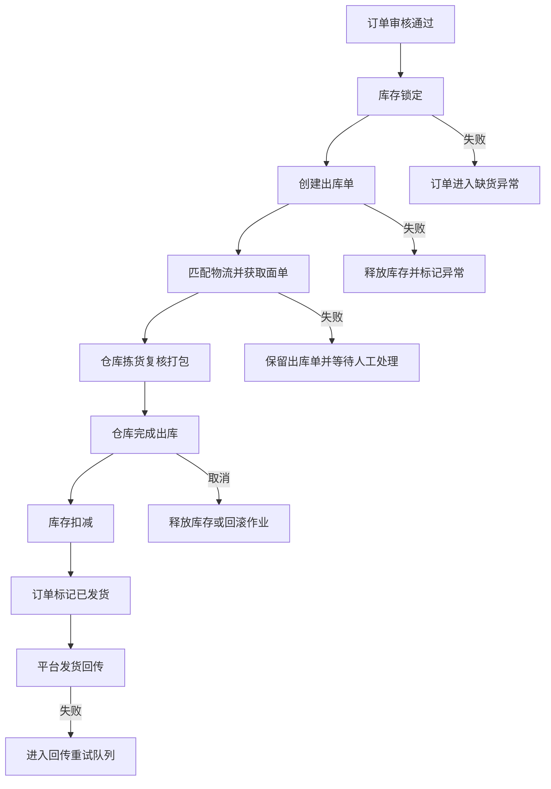
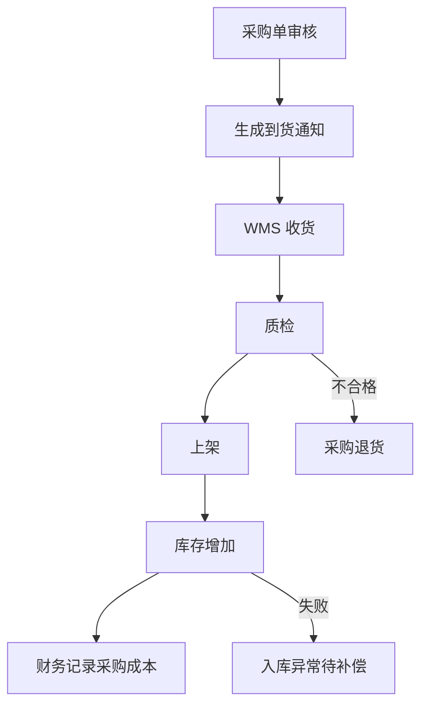

# 接口与事件设计

## 1. 设计目标

本文档定义 ERP-Go 微服务之间的接口协作、事件模型、消息可靠性、Saga 流程、幂等规则和错误处理规范。实现时应优先保证服务边界清晰、调用方向可控、异常可恢复、数据最终一致。

## 2. 接口类型

| 类型 | 使用场景 | 示例 |
| --- | --- | --- |
| HTTP REST | 前端访问、开放 API、低频查询和管理操作 | 查询订单、创建采购单、导出报表 |
| gRPC | 服务间高频同步查询或命令 | 校验权限、查询 SKU、申请库存锁定 |
| 领域事件 | 跨服务状态变更、异步解耦 | 订单已审核、库存已锁定、仓库已出库 |
| 批量导入 | 平台报告、订单 CSV、物流账单 | 订单导入、结算导入 |
| Webhook | 对外通知第三方系统 | 发货通知、库存变更通知 |

## 3. API 通用规范

### 3.1 请求头

| 请求头 | 说明 |
| --- | --- |
| `Authorization` | 用户访问令牌 |
| `X-Tenant-ID` | 租户 ID |
| `X-Request-ID` | 请求唯一 ID |
| `X-Trace-ID` | 链路追踪 ID |
| `Idempotency-Key` | 写操作幂等键 |
| `Accept-Language` | 语言 |
| `X-Timezone` | 时区 |

### 3.2 响应结构

统一响应应包含：

| 字段 | 说明 |
| --- | --- |
| `code` | 业务错误码 |
| `message` | 用户可理解的错误或成功信息 |
| `data` | 响应数据 |
| `request_id` | 请求 ID |
| `trace_id` | 链路追踪 ID |

列表响应应包含：

| 字段 | 说明 |
| --- | --- |
| `items` | 当前页数据 |
| `page` | 页码 |
| `page_size` | 每页数量 |
| `total` | 总数 |

### 3.3 错误码分类

| 范围 | 类型 |
| --- | --- |
| `0` | 成功 |
| `10000-19999` | 通用错误 |
| `20000-29999` | 权限和租户错误 |
| `30000-39999` | 商品和渠道错误 |
| `40000-49999` | 订单错误 |
| `50000-59999` | 库存和仓储错误 |
| `60000-69999` | 物流错误 |
| `70000-79999` | 采购和财务错误 |
| `80000-89999` | 外部系统错误 |

## 4. 接口设计原则

- 写接口必须支持幂等。
- 查询接口必须支持分页、排序、过滤和字段投影。
- 批量接口必须返回每条记录的成功、失败和错误原因。
- 外部开放接口必须签名，签名内容包含请求路径、请求体摘要、时间戳和随机串。
- 服务间接口不返回数据库内部错误，必须转换成统一业务错误。
- 接口版本通过路径或协议版本管理，不能破坏现有调用方。

## 5. 核心服务接口清单

### 5.1 订单服务

| 接口 | 类型 | 调用方 | 说明 |
| --- | --- | --- | --- |
| 导入订单 | gRPC/事件 | 渠道服务 | 幂等创建平台订单 |
| 审核订单 | HTTP/gRPC | 前端、自动任务 | 执行订单审核流程 |
| 查询订单列表 | HTTP | 前端 | 多条件分页查询 |
| 查询订单详情 | HTTP/gRPC | 前端、仓储服务 | 获取订单和明细 |
| 取消订单 | HTTP/gRPC | 前端、渠道服务 | 取消未出库订单 |
| 创建售后单 | HTTP | 前端、渠道服务 | 创建退款、退货、补发、换货 |

### 5.2 库存服务

| 接口 | 类型 | 调用方 | 说明 |
| --- | --- | --- | --- |
| 查询可售库存 | gRPC | 订单服务、渠道服务 | 查询 SKU 可售数量 |
| 锁定库存 | gRPC/事件 | 订单服务 | 为订单锁定库存 |
| 释放库存 | gRPC/事件 | 订单服务、WMS | 取消或异常时释放 |
| 扣减库存 | 事件 | WMS | 出库完成后扣减 |
| 增加库存 | 事件 | WMS、采购服务 | 入库完成后增加 |
| 库存调整 | HTTP | 前端 | 盘点、冻结、报损 |

### 5.3 WMS 仓储服务

| 接口 | 类型 | 调用方 | 说明 |
| --- | --- | --- | --- |
| 创建出库单 | 事件/gRPC | 库存服务、订单服务 | 库存锁定后创建 |
| 查询拣货任务 | HTTP | PDA | 查询待拣货任务 |
| 提交拣货结果 | HTTP | PDA | 扫码确认拣货 |
| 提交复核结果 | HTTP | PDA | 扫码复核 |
| 提交打包结果 | HTTP | PDA | 包装、称重、绑定面单 |
| 完成出库 | HTTP/事件 | PDA、仓库任务 | 触发库存扣减 |

### 5.4 TMS 物流服务

| 接口 | 类型 | 调用方 | 说明 |
| --- | --- | --- | --- |
| 匹配物流渠道 | gRPC | 订单服务、WMS | 返回可用物流产品 |
| 创建面单 | gRPC/HTTP | WMS | 获取面单和运单号 |
| 取消面单 | gRPC/HTTP | WMS、订单服务 | 取消未交运包裹 |
| 查询轨迹 | HTTP/gRPC | 前端、订单服务 | 查询物流轨迹 |
| 导入物流账单 | HTTP | 财务服务、前端 | 导入费用 |

### 5.5 渠道服务

| 接口 | 类型 | 调用方 | 说明 |
| --- | --- | --- | --- |
| 店铺授权 | HTTP | 前端 | 创建或更新平台授权 |
| 触发订单同步 | HTTP/任务 | 前端、定时任务 | 同步平台订单 |
| 推送库存 | 事件/任务 | 库存服务 | 将可售库存推送平台 |
| 回传发货 | 事件/任务 | 订单服务 | 回传运单号和物流商 |
| 导入结算报告 | 任务 | 财务服务 | 下载并解析平台结算 |

## 6. 领域事件规范

### 6.1 事件通用字段

| 字段 | 说明 |
| --- | --- |
| `event_id` | 事件唯一 ID |
| `event_type` | 事件类型 |
| `event_version` | 事件版本 |
| `tenant_id` | 租户 ID |
| `aggregate_id` | 聚合根 ID |
| `aggregate_type` | 聚合类型 |
| `occurred_at` | 事件发生时间 |
| `trace_id` | 链路追踪 ID |
| `producer` | 生产服务 |
| `payload` | 事件内容 |

### 6.2 核心事件清单

| 事件 | 生产者 | 消费者 | 说明 |
| --- | --- | --- | --- |
| 订单已导入 | 渠道服务 | 订单服务、报表服务 | 平台订单进入系统 |
| 订单已审核 | 订单服务 | 库存服务、报表服务 | 订单通过审核 |
| 订单已取消 | 订单服务 | 库存服务、WMS、渠道服务 | 取消订单并触发补偿 |
| 库存已锁定 | 库存服务 | 订单服务、WMS | 库存锁定成功 |
| 库存锁定失败 | 库存服务 | 订单服务 | 缺货或冲突 |
| 出库单已创建 | WMS | 订单服务、报表服务 | 仓库开始履约 |
| 仓库已出库 | WMS | 库存服务、订单服务、TMS | 仓库完成出库 |
| 发运单已创建 | TMS | 订单服务、渠道服务 | 获取运单号 |
| 轨迹已更新 | TMS | 订单服务、售后、报表服务 | 物流节点变化 |
| 采购已到货 | 采购服务 | WMS | 采购到货通知 |
| 采购已入库 | WMS | 库存服务、财务服务 | 入库完成 |
| 平台结算已导入 | 渠道服务 | 财务服务、报表服务 | 结算报告完成 |

## 7. Saga 流程设计

### 7.1 订单发货 Saga

### 7.2 采购入库 Saga

## 8. 幂等设计

| 场景 | 幂等键 |
| --- | --- |
| 平台订单导入 | 租户 ID + 店铺 ID + 平台订单号 |
| 库存锁定 | 租户 ID + 订单号 + SKU + 仓库 |
| 库存释放 | 租户 ID + 库存锁定号 + 释放原因 |
| 库存扣减 | 租户 ID + 出库单号 + SKU |
| 面单创建 | 租户 ID + 出库单号 + 包裹号 |
| 发货回传 | 租户 ID + 店铺 ID + 平台订单号 + 运单号 |
| 结算导入 | 租户 ID + 店铺 ID + 平台报告 ID |
| 轨迹导入 | 运单号 + 事件时间 + 事件编码 |

## 9. 可靠消息设计

推荐使用 Outbox 模式：

1. 业务服务在本地事务中写业务表和 outbox 表。
2. 事件发布器扫描 outbox 表并投递消息队列。
3. 投递成功后标记 outbox 事件已发布。
4. 消费者记录 inbox 或消费日志，防止重复消费。
5. 消费失败进入重试队列。
6. 超过重试阈值进入死信队列，等待人工补偿。

## 10. 消息主题建议

| 主题 | 说明 |
| --- | --- |
| `订单事件` | 订单导入、审核、取消、发货、售后 |
| `库存事件` | 锁定、释放、扣减、入库、调整 |
| `仓储事件` | 出库单创建、拣货、复核、打包、出库 |
| `物流事件` | 面单、发运、轨迹、异常件 |
| `采购事件` | 采购审核、到货、质检、退货 |
| `财务事件` | 结算导入、成本生成、利润重算 |
| `通知事件` | 邮件、短信、站内信、Webhook |

## 11. 外部系统接口设计

### 11.1 平台接口

所有平台能力必须通过渠道服务适配器访问。业务服务不得直接调用平台 API。

适配器能力：

- 拉取订单。
- 获取订单详情。
- 同步商品和刊登。
- 推送库存。
- 回传发货。
- 下载退货和结算报告。

### 11.2 物流接口

所有物流商能力必须通过 TMS 物流服务适配器访问。

适配器能力：

- 创建面单。
- 取消面单。
- 查询轨迹。
- 查询报价。
- 下载面单。
- 导入账单。

### 11.3 海外仓接口

海外仓可作为仓储服务的外部适配器，也可作为独立 3PL 连接器。

适配器能力：

- 查询海外仓库存。
- 创建入库预报。
- 创建出库单。
- 查询出库状态。
- 同步轨迹和费用。

## 12. 契约测试要求

- 每个服务对外接口必须有契约定义。
- 消费方依赖接口变更时，必须先更新契约测试。
- 事件 payload 增加字段必须兼容旧消费者。
- 删除字段、改名字段、改变语义都属于破坏性变更，必须升版本。

