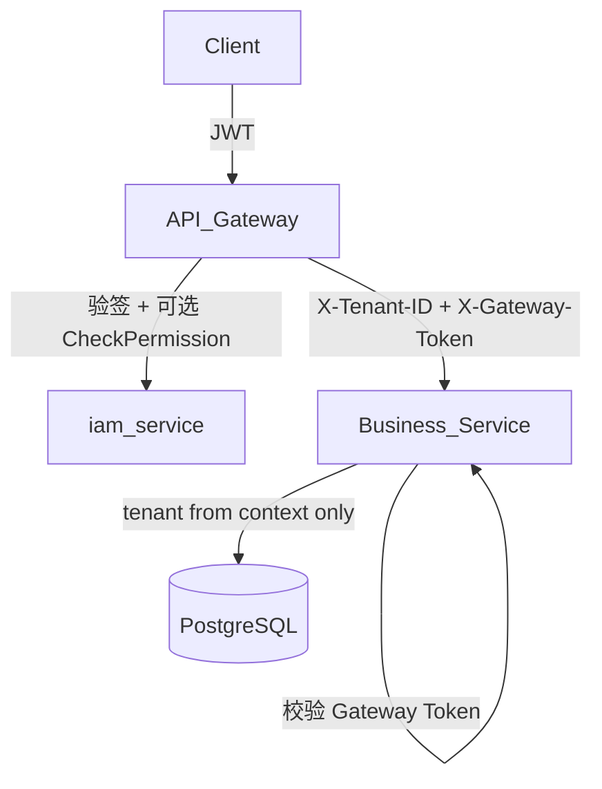

# ERP-Go 面试答辩与改进路线图

> 本文档对应「面试官视角挑刺」计划的四项交付物：架构答辩、安全模型、测试口径、工程化路线图。  
> 数据口径：2026-06-19，revision `334c1c1`；与 [待办清单.md](./待办清单.md)、[README.md](../README.md) 配合使用。

---

## 一、架构叙事 vs 现实差距（答辩稿）

### 1.1 面试官会挑什么

| 挑刺点 | 代码/文档证据 | 杀伤力 |
| --- | --- | --- |
| 「微服务」实为强耦合 monorepo | 根目录单 `go.mod`；`go test -C backend ./...` 全量编译 | 高 |
| 独立 DB vs schema 隔离 | [项目架构设计.md](./项目架构设计.md) 写 database-per-service；实现为单 PG + 各服务 `CREATE SCHEMA` | 高 |
| gRPC 设计了未落地 | 仅 [backend/proto/iam/v1/iam.proto](../backend/proto/iam/v1/iam.proto)，无 codegen | 中 |
| Saga 不在服务边界内 | [backend/shared/workflows](../backend/shared/workflows) 集中 P4/P5 编排 | 高 |
| 中间件 over-provision | Compose 起 9 个组件，业务主要用 PG + RabbitMQ | 中 |
| 服务成熟度不均 | `order-service` 自建 main；其余 12 服务走 `shared/server/bootstrap` | 中 |
| 完成度口径矛盾 | README「多数 HTTP 占位」vs 待办清单「98%」 | 高 |

### 1.2 推荐答辩框架（不狡辩，讲清阶段与取舍）

**开场定位（30 秒）**

> ERP-Go 是**按微服务边界建模、按 monorepo 工程落地**的跨境电商 ERP。当前阶段优先打透**订单履约闭环（P4）**，物理部署尚未完全服务化，但逻辑边界、数据所有权、事件契约已按 13 个服务拆分。

**逐条回应**

#### Q1：为什么单 `go.mod` 还叫微服务？

| 维度 | 当前选择 | 理由 | 演进 |
| --- | --- | --- | --- |
| 编译单元 | 单 Go 模块 | 降低早期协作成本；shared 层（outbox/errors/response）复用 | 服务稳定后可 `go.work` 或多 module |
| 运行时 | 13 进程 + 独立端口 | 已具备独立扩缩容接口 | Helm values 已列各服务端口（T-504） |
| 数据 | schema 隔离 | 开发/演示阶段足够；迁移脚本按服务目录维护 | T-501+ 可按服务拆库 |

**一句话**：逻辑微服务 + 物理 monorepo，是**有意为之的阶段性架构**，不是设计失误。

#### Q2：schema 隔离够吗？故障边界在哪？

**诚实承认**：单实例 PG 下，慢查询、连接池耗尽、磁盘满会影响全部 schema——**没有 database-per-service 的 blast radius 隔离**。

**已有缓解**：

- 各服务 repository 只访问本 schema（如 `orders`、`iam`）
- Outbox/Inbox 在根级 `backend/migrations/outbox/`，与业务 schema 分离
- [backend/migrations/README.md](../backend/migrations/README.md) 明确服务级 migration 为唯一事实源

**演进路径**（面试可说「我知道代价，计划是……」）：

1. 短期：连接池按服务配置、慢查询告警、schema 级 backup
2. 中期：Order/Inventory/Warehouse 高 QPS 服务迁出独立库
3. 长期：读写分离 + 报表库（report-service 只读聚合）

#### Q3：为什么 P4 编排在 `shared/workflows` 而不是 order-service？

**当前实现**：[p4_outbound_flow.go](../backend/shared/workflows/p4_outbound_flow.go) 由 `order-service/cmd/server/main.go` 注入 HTTP 适配器（inventory/warehouse URL），通过接口 `StockHandler` / `OutboundCreator` 解耦。

**答辩要点**：

- **编排归属**：业务流程「订单审核 → 锁库存 → 建出库单」的**发起方是 Order**，协调器放在 shared 是**工程折中**（避免 order 包 import warehouse internal）
- **边界未破坏**：workflow 只依赖**接口 + 事件 payload**，不直接访问他库表
- **已知代价**：改 workflow 需全量重编——接受，因 P4 是核心路径、变更频率可控
- **改进方向**：将 `P4OutboundFlowCoordinator` 移入 `order-service/internal/app`，shared 只保留事件类型与 DTO（任务 **T-601**，见 §四）

#### Q4：gRPC proto 写了为什么不用？

**答辩**：契约先行。IAM proto 定义了 `CheckPermission`，为网关细粒度鉴权预留；当前阶段服务间用 **REST + 事件** 足够验证 P4 闭环。gRPC 列入 T-602，在 OpenAPI 稳定后再 codegen，避免双契约漂移。

#### Q5：Compose 起了 Redis/MinIO/OpenSearch 但没用？

**答辩**：按 [技术栈与中间件管理规范.md](./技术栈与中间件管理规范.md) **预留能力位**：

| 组件 | 规划用途 | 任务 |
| --- | --- | --- |
| Redis | 会话/限流/分布式锁 | T-603 |
| MinIO | file-service 对象存储 | T-502 |
| OpenSearch | 商品/订单检索 | T-604 |
| Jaeger/Prometheus | 可观测性 | T-605 |

本地栈一次拉起，避免后续接中间件时改 Compose；**文档已标明未接入**，不算过度包装。

#### Q6：98% 完成 vs 多数 HTTP 占位？

见 **§三** 完成度口径统一说明。答辩时主动区分：

- **功能验收 98%**：§6 清单 30/31 项（P0–P9 后端闭环 + 前端可操作）
- **HTTP 全覆盖**：非当前里程碑；README「尚未完成」指**非核心路径的 CRUD 深度**

### 1.3 ADR 编号治理（文档债）

[docs/adr/](./adr/) 存在重复编号（两个 ADR-006、两个 ADR-007）。答辩时说明为并行撰写未合并，**T-606** 将重编号为 ADR-008/009 并更新索引。

---

## 二、安全链路与租户隔离

### 2.1 当前架构（诚实描述）

```text
Browser / PDA
    │  Authorization: Bearer <JWT>
    ▼
API Gateway (:8080)
    │  parseJWT（仅验签，不验 RBAC）
    │  Set X-User-ID, X-Tenant-ID
    ▼
微服务 (:8081–8094)
    │  middleware.TenantID() 直接读 X-Tenant-ID
    ▼
Repository WHERE tenant_id = ?
```

**关键文件**：

- 网关 JWT：[backend/gateway/cmd/server/main.go](../backend/gateway/cmd/server/main.go)（默认 secret fallback）
- 租户头：[backend/shared/middleware/middleware.go](../backend/shared/middleware/middleware.go) `TenantID()`
- IAM 签发：[backend/services/iam-service/internal/infra/jwt.go](../backend/services/iam-service/internal/infra/jwt.go)

### 2.2 面试官追问与标准答案

| 追问 | 当前事实 | 答辩 + 改进 |
| --- | --- | --- |
| 租户头可伪造？ | 是，直连微服务端口可绕过网关 | **T-607**：生产 NetworkPolicy 仅允许 gateway → 服务；服务校验 `X-Internal-Gateway-Secret` 或 mTLS |
| Gateway 不验权限？ | 是，仅 JWT 有效即可 | **T-608**：实现 `CheckPermission` gRPC/HTTP 或网关侧 RBAC 缓存 |
| 两套 JWT secret？ | gateway 与 iam 默认 secret 字符串不同 | **T-609**：启动时 `ENVIRONMENT=production` 强制校验 `JWT_SECRET` 非默认值，否则 `os.Exit(1)` |
| fallback 模式 200？ | DB 未就绪仍返回成功形态 | **T-610**：`ENVIRONMENT != development` 时禁止 fallback；health 返回 `degraded` + readiness 失败 |
| CORS `*`？ | 开发便利 | **T-611**：生产通过 `CORS_ALLOWED_ORIGINS` 白名单 |

### 2.3 目标安全模型（改进后）



### 2.4 租户隔离检查清单（实现 T-607–T-611 后）

| 层级 | 措施 | 验证 |
| --- | --- | --- |
| 网络 | K8s NetworkPolicy：仅 gateway ServiceAccount 可访问业务 Service | `kubectl describe networkpolicy` |
| 网关 | JWT 验签 + 注入不可伪造的内部头 | 契约测试扩展 `contract_test.go` |
| 服务 | 拒绝无 `X-Gateway-Token` 的外部请求（非 dev） | handler 单测 |
| 数据 | 所有查询带 `tenant_id`；repository 层禁止无 tenant 全表扫 | testcontainers 集成测 |
| 配置 | 生产拒绝默认 secret/密码 | 启动单测 `TestProductionConfigRejectsDefaults` |
| 可观测 | 审计日志含 tenant_id + user_id | IAM audit 表查询 |

### 2.5 与现有任务映射

| 新编号 | 内容 | 关联 |
| --- | --- | --- |
| T-607 | 服务间 Gateway Token + NetworkPolicy 骨架 | T-003 K8s RBAC |
| T-608 | Gateway RBAC（CheckPermission 或 JWT claims 扩展） | iam.proto |
| T-609 | 生产环境拒绝默认 JWT/DB 密码 | T-412 安全 QG |
| T-610 | 非 dev 禁用 fallbackMode | README 生产注意事项 |
| T-611 | CORS 白名单配置化 | shared/config |

---

## 三、测试策略与完成度口径

### 3.1 「98%」到底是什么意思

[待办清单.md §6](./待办清单.md) 定义的功能验收 **30/31** 项，衡量的是**里程碑任务完成度**，不是「每一行 HTTP handler 都有集成测试」。

| 口径 | 来源 | 含义 | 未完成项 |
| --- | --- | --- | --- |
| 功能完成度 ~98% | 待办清单 §1 | §6 清单 30/31 勾选 | T-411 Hotspot 审查（质量门，非功能） |
| 发布就绪度 ~94% | 待办清单 §1 | QG Red（安全 E + Hotspot 0%） | T-412/T-002 |
| 多数 HTTP 占位 | README §尚未完成 | 非 P4 核心路径的 CRUD 深度、WMS 全量作业 | 与 98% **不矛盾** |

**答辩话术**：

> 98% 指 P0–P9 **闭环验收清单**的完成率（订单履约、Outbox、PDA 可操作、前端接真实 API 等）。README 说的「占位」是指商品/渠道等服务的 HTTP 层尚未做到生产级 CRUD 深度——我们在文档里刻意分开写，避免过度承诺。

### 3.2 当前测试金字塔（实测）

| 层级 | 文件数 | 代表 | 缺口 |
| --- | ---: | --- | --- |
| Domain 单测 | 17+ | `*/domain/*_test.go` | 无（13 服务全覆盖） |
| App 单测 | 1 | `order_app_service_test.go` | 其余 12 服务 app 层 |
| Workflow | 1 | `p4_outbound_flow_test.go`（13 cases） | P5 采购入库 workflow |
| Outbox | 1 | `outbox_test.go`（12 cases） | RabbitMQ 真实 broker 测 |
| Repository 集成 | 1 | `repository_test.go`（testcontainers） | 其余服务 repo |
| HTTP Handler | **0** | — | **最大缺口** |
| 契约 | 3 | gateway contract、response_contract、tracking_contract | OpenAPI 快照 |
| 集成 | 1 | `fulfillment_flow_test.go`（httptest 模拟） | 真实 DB 全链路 |
| 前端 | **0** | — | Playwright（T-308 可选） |
| E2E | 0 | `testing/e2e/README.md` 占位 | 见 T-308 |

**总计**：backend 约 **27** 个 `*_test.go`（待办清单写 24 测试包为统计口径差异，以 `go test -C backend ./...` 为准）。

### 3.3 命名纠偏

以下文件名为 `*_integration_test.go`，实为 **domain 内存流程**，非 DB/HTTP 集成：

- `finance_integration_test.go`
- `purchase_integration_test.go`

**T-612**：重命名为 `*_flow_test.go` 或 `*_scenario_test.go`，避免面试官误解。

### 3.4 补测路线图（4 周）

#### 第 1 周：HTTP 边界（P0）

| ID | 范围 | 方法 | 验收 |
| --- | --- | --- | --- |
| T-613 | `iam-service` login/refresh | `httptest` + 内存 repo 或 test DB | 401/200/业务码 |
| T-614 | `order-service` audit/cancel/list | `httptest` + mock app | 状态码、分页、tenant 头 |
| T-615 | Gateway auth skip paths | 扩展 `contract_test.go` 为断言而非 `t.Logf` | CI 失败即破 |

#### 第 2 周：Repository + 租户

| ID | 范围 | 方法 | 验收 |
| --- | --- | --- | --- |
| T-616 | `inventory-service` repository | testcontainers | 行锁、幂等键 |
| T-617 | 跨 tenant 访问拒绝 | 共用 test helper | 返回 403/404 |

#### 第 3 周：集成与契约

| ID | 范围 | 方法 | 验收 |
| --- | --- | --- | --- |
| T-618 | P4 全链路 | testcontainers PG + httptest 双服务 | 对齐 `order-fulfillment-smoke` runbook |
| T-619 | 响应 envelope 快照 | 扩展 `testing/contract/` | `list` 字段与文档一致 |

#### 第 4 周：E2E（可选）

| ID | 范围 | 方法 | 验收 |
| --- | --- | --- | --- |
| T-308 | admin 登录 → 审单 | Playwright | `dev-stack.ps1 all` 后一条脚本 |
| T-620 | CI 分层 | `go test -short` vs 集成 tag `//go:build integration` | PR 快、nightly 全量 |

### 3.5 覆盖率目标（务实）

| 阶段 | 目标 | 说明 |
| --- | --- | --- |
| 当前 | Sonar 上报 coverage.out | T-406 已完成 |
| +4 周 | 关键路径 handler ≥60% | IAM + Order + Gateway |
| +8 周 | P4 相关包 ≥70% | workflow + outbox + order app/repo |
| 不追求 | 全仓库 80% | domain 已覆盖，边际收益低 |

---

## 四、工程规范缺口与改进路线图

### 4.1 规范 vs 实现差距矩阵

| 规范来源 | 要求 | 现状 | 任务 |
| --- | --- | --- | --- |
| [实施路线与工程规范.md](./实施路线与工程规范.md) | 每服务 Dockerfile | **0** 个 Dockerfile | **T-621** |
| 同上 | OpenAPI 或 gRPC 契约 | 1 个 proto，无 OpenAPI | **T-622** |
| [backend/migrations/README.md](../backend/migrations/README.md) | golang-migrate 可选 | 手工 psql | **T-623** |
| CI | lint 全栈 | Go 仅 vet；前端 eslint 未进 verify | **T-624** |
| CI | 镜像构建/扫描 | 无 | **T-625** |
| 设计文档 | 分页字段 `items` | 实现 `list` | **T-626** 文档或代码二选一对齐 |

### 4.2 30 天工程化节奏（与待办清单 §2 对齐）

```text
第 1 周（安全基线，已有 T-001~T-006）
  T-609 生产拒绝默认 secret
  T-610 禁用生产 fallback
  T-624 verify 加入 npm run lint

第 2 周（容器化最小闭环）
  T-621 Dockerfile（gateway + order 多阶段构建）
  T-625 CI: docker build + trivy scan（仅上述两镜像）
  T-622 OpenAPI 草案（gateway 聚合 /api/v1）

第 3 周（迁移与契约）
  T-623 golang-migrate 试点（order-service schema）
  T-626 统一分页字段名（推荐代码保持 list，改文档）
  T-612 重命名误导性 integration_test

第 4 周（可观测 + 架构债）
  T-605 OTel trace 接入 P4 路径
  T-601 workflow 迁入 order-service/app
  T-606 ADR 重编号
```

### 4.3 T-621 Dockerfile 设计要点（实施时参考）

```dockerfile
# 多阶段：builder → distroless/alpine
# BUILD_TARGET=gateway|order-service
# 入口：/app/server
# 健康检查：GET /health
# 非 root 用户运行
```

- 构建上下文：仓库根（单 go.mod）
- CI：`docker build --build-arg SERVICE=gateway -f docker/Dockerfile.service .`
- 与 [docker/helm/erp-go/](../docker/helm/erp-go/) values 镜像 tag 对齐（T-504）

### 4.4 T-622 OpenAPI 策略

1. **阶段 1**：手写 `docs/openapi/gateway-v1.yaml`，仅覆盖 P4 相关路径（order/inventory/warehouse/iam auth）
2. **阶段 2**：`backend/testing/contract` 用 openapi 校验响应 schema（可选 kin-openapi）
3. **不阻塞**：gRPC codegen（T-602）在 OpenAPI 稳定后进行

### 4.5 T-623 迁移工具试点

| 步骤 | 内容 |
| --- | --- |
| 1 | `order-service` 引入 `golang-migrate`，`migrations/` 改为 `000001_init.up.sql` / `.down.sql` |
| 2 | `schema_migrations` 表记录在 `orders` schema |
| 3 | `dev-stack.ps1` 调用 `migrate -path ... -database $URL` |
| 4 | 其余服务按字母序逐步迁移；根级 outbox 保持独立 |

### 4.6 T-624 CI / Lint 补齐

**verify.ps1 / verify.sh 追加**：

```bash
npm run lint --workspaces --if-present
```

**可选第二阶段**：

- `.golangci.yml`：`govet`、`errcheck`、`staticcheck` 最小集
- `lefthook` 或 pre-commit：`gofmt -l` + `npm run lint`

### 4.7 文档索引修正

[文档索引.md](./文档索引.md) 原「不包含实际业务代码实现」已过时——仓库含 13 服务实现与 180+ 测试。索引已更新为「设计 + 实现双轨」。

---

## 五、面试 10 问速答卡

| # | 问题 | 一句话答案 |
| ---: | --- | --- |
| 1 | P4 为何在 shared/workflows？ | 编排属 Order 域，shared 是接口化折中；计划迁入 order app（T-601） |
| 2 | Gateway 不验权限？ | 当前仅验签；T-608 接 CheckPermission 或 JWT claims |
| 3 | schema 隔离够吗？ | 开发够，生产需拆库计划；单库 blast radius 已承认 |
| 4 | Outbox 双通道排障？ | 统一 correlation_id；T-605 接 OTel；Outbox 查询 API 已有（T-203） |
| 5 | fallback 200？ | 仅 development；T-610 生产 fail fast |
| 6 | 镜像从哪来？ | 坦诚无 Dockerfile；T-621/T-625 四周内补 gateway+order |
| 7 | 98% vs 占位？ | 98%=§6 里程碑；占位=非核心 HTTP 深度 |
| 8 | 单 go.mod 独立发版？ | 当前 tag 全量；镜像可按服务 build；长期 go.work |
| 9 | 前端零测试？ | T-308 Playwright；关键 Store 靠 typecheck + 手工 smoke |
| 10 | Sonar 安全 E？ | 1 BLOCKER 种子 SQL（T-002）；先 T-609/T-610 再谈上线 |

---

## 六、相关文档

- [待办清单.md](./待办清单.md) — T-xxx 任务与 §6 验收
- [README.md](../README.md) — 仓库状态快照（偏保守口径）
- [sonarcloud-report.md](./sonarcloud-report.md) — 质量门详情
- [runbooks/order-fulfillment-smoke.md](./runbooks/order-fulfillment-smoke.md) — P4 手工验证
- [adr/007-event-dual-channel.md](./adr/007-event-dual-channel.md) — Outbox + RabbitMQ 职责

---

## 七、新增任务索引（T-601 ~ T-626）

| ID | 章节 | 摘要 |
| --- | --- | --- |
| T-601 | §一 | workflow 迁入 order-service/app |
| T-602 | §一 | gRPC codegen 试点（IAM） |
| T-603 | §一 | Redis 接入（会话/限流） |
| T-604 | §一 | OpenSearch 接入 |
| T-605 | §一/§四 | OTel trace P4 链路 |
| T-606 | §一 | ADR 重编号 |
| T-607 | §二 | Gateway Token + NetworkPolicy |
| T-608 | §二 | Gateway RBAC |
| T-609 | §二 | 生产拒绝默认 secret |
| T-610 | §二 | 生产禁用 fallback |
| T-611 | §二 | CORS 白名单 |
| T-612 | §三 | 重命名误导性 integration_test |
| T-613 | §三 | IAM handler httptest |
| T-614 | §三 | Order handler httptest |
| T-615 | §三 | Gateway contract 断言化 |
| T-616 | §三 | Inventory repository testcontainers |
| T-617 | §三 | 跨 tenant 拒绝测试 |
| T-618 | §三 | P4 testcontainers 全链路 |
| T-619 | §三 | 契约快照扩展 |
| T-620 | §三 | CI test tag 分层 |
| T-621 | §四 | Dockerfile（gateway+order） |
| T-622 | §四 | OpenAPI gateway-v1 |
| T-623 | §四 | golang-migrate 试点 |
| T-624 | §四 | verify 加入 eslint |
| T-625 | §四 | CI docker build + scan |
| T-626 | §四 | 分页字段文档对齐 |
