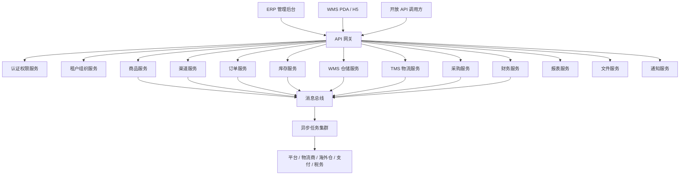
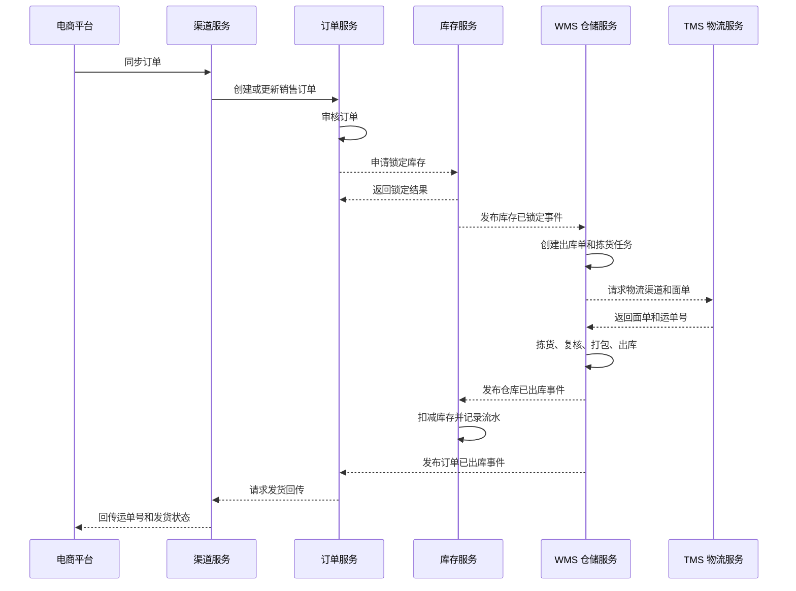
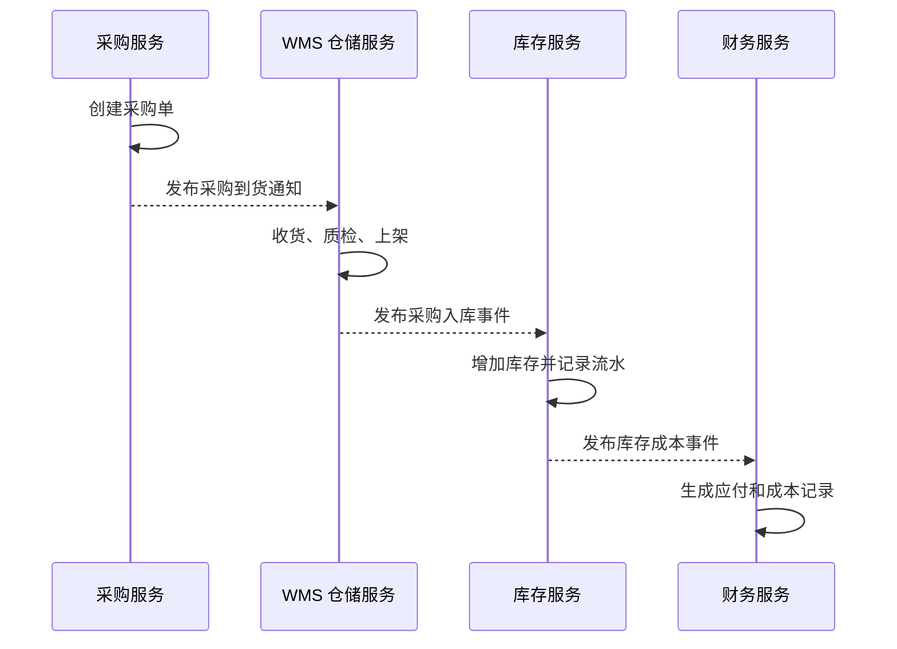
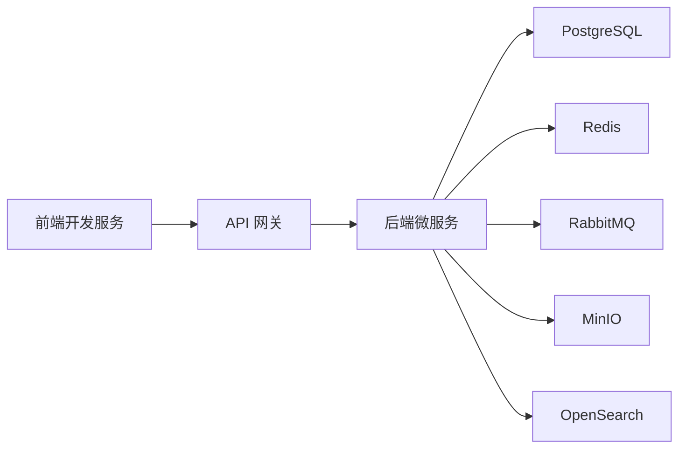
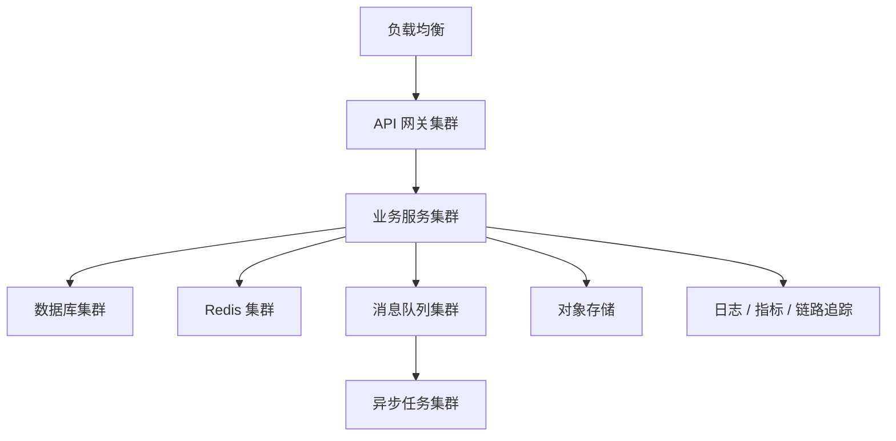

# 项目架构设计

## 1. 项目定位

ERP-Go 是一个面向跨境电商业务的一体化 ERP 系统，覆盖商品、渠道、订单、采购、库存、WMS 仓储、TMS 物流、财务结算、报表分析和系统管理。系统参考 Amazon Seller Central、主流跨境 ERP、成熟 WMS/TMS 和电商中台的产品能力，但实现上以自有微服务体系为核心，保证可扩展、可替换、可审计和可持续演进。

系统第一阶段即采用微服务架构。每个核心业务域独立服务、独立数据库或独立 Schema、独立部署、独立扩容。服务之间通过 API Gateway、gRPC、REST API、消息队列、领域事件和 Saga 协作。

## 2. 业务目标

- 支持多租户、多组织、多店铺、多平台、多仓库、多币种和多税制。
- 打通跨境电商从刊登、订单、采购、入库、库存、出库、物流、售后到财务核算的主流程。
- 支持 Amazon 等平台订单同步、库存推送、发货回传、退货和结算数据导入。
- 支持本地仓、海外仓、平台仓、第三方仓和虚拟仓。
- 支持库存可追溯、财务可审计、操作可回放、异常可补偿。
- 支持服务级水平扩展、故障隔离、灰度发布、链路追踪和自动化测试。

## 3. 顶层目录结构

```text
ERP-Go/
  backend/
  frontend/
  docker/
  testing/
  docs/
```

目录说明：

| 目录 | 职责 |
| --- | --- |
| `backend` | 后端微服务、网关、异步任务、共享协议、数据库迁移、领域代码 |
| `frontend` | ERP 管理后台、WMS PDA、经营看板等前端应用 |
| `docker` | Docker Compose、Kubernetes、Nginx、监控、部署脚本 |
| `testing` | 集成测试、契约测试、端到端测试、性能测试和外部系统模拟 |
| `docs` | 架构、领域、接口、事件、数据、工程规范等设计文档 |

## 4. 微服务总体架构



## 5. 服务清单

| 服务 | 核心职责 | 是否首期必需 |
| --- | --- | --- |
| API 网关 | 统一入口、路由、鉴权、限流、聚合、审计、灰度 | 是 |
| 认证权限服务 | 用户、角色、权限、菜单、登录、Token、审计 | 是 |
| 租户组织服务 | 租户、组织、部门、数据范围、套餐配额 | 是 |
| 商品服务 | SPU、SKU、组合商品、条码、平台 SKU 映射、申报资料 | 是 |
| 渠道服务 | 店铺授权、平台订单同步、库存推送、发货回传、API 日志 | 是 |
| 订单服务 | 销售订单、审核、拆合单、异常、售后、退款、补发 | 是 |
| 库存服务 | 库存余额、锁定、释放、扣减、调拨、盘点、流水 | 是 |
| WMS 仓储服务 | 入库、上架、库位、波次、拣货、复核、打包、出库 | 是 |
| TMS 物流服务 | 物流商、渠道规则、面单、包裹、轨迹、运费 | 是 |
| 采购服务 | 供应商、采购计划、采购单、到货、质检、退货 | 二期 |
| 财务服务 | 应收应付、平台结算、成本、汇率、利润核算 | 二期 |
| 报表服务 | 销售、库存、仓储、物流、利润分析 | 一期基础，二期增强 |
| 文件服务 | 商品图片、面单、发票、导入导出文件 | 是 |
| 通知服务 | 邮件、短信、站内信、Webhook、告警 | 是 |

## 6. 核心业务流程

### 6.1 平台订单到仓库发货



### 6.2 采购到入库



## 7. 面向对象设计原则

### 7.1 设计原则

- 单一职责：一个对象只负责一个明确业务概念，例如订单负责订单状态，库存余额负责库存数量约束。
- 开闭原则：平台、物流商、海外仓通过适配器扩展，不修改核心业务对象。
- 里氏替换：同类接口实现必须行为一致，例如所有物流适配器都必须支持统一的下单、取消、轨迹查询语义。
- 接口隔离：不要设计巨大接口，应按订单同步、库存推送、面单获取、轨迹查询拆分接口。
- 依赖倒置：应用服务依赖接口，不依赖具体数据库、消息队列或外部平台实现。
- 组合优先：优先通过策略、规则、适配器组合能力，避免深层继承。
- 显式状态机：订单、出库单、采购单、发运单、售后单等必须用状态机约束状态流转。

### 7.2 对象分类

| 类型 | 说明 | 示例 |
| --- | --- | --- |
| 聚合根 | 控制一组相关对象的一致性边界 | 销售订单、库存余额、出库单、采购单、发运单 |
| 实体 | 有唯一标识且生命周期持续变化 | SKU、仓库、库位、物流商、供应商 |
| 值对象 | 无独立身份，通过属性表达含义 | 金额、地址、重量、尺寸、币种、时间范围 |
| 领域服务 | 跨多个对象的业务规则 | 库存分配服务、订单审核服务、物流匹配服务 |
| 应用服务 | 编排用例、事务、权限、跨服务调用 | 订单审核应用服务、出库应用服务 |
| 仓储接口 | 屏蔽持久化细节 | 订单仓储、库存仓储、出库单仓储 |
| 适配器 | 对接外部系统 | Amazon 适配器、物流商适配器、海外仓适配器 |

## 8. 技术栈约束

| 类别 | 约束 |
| --- | --- |
| 后端语言 | Go，所有后端业务服务统一使用 Golang |
| HTTP 框架 | Gin |
| 服务间通信 | REST + gRPC + 领域事件 |
| 消息队列 | RabbitMQ |
| 数据库 | PostgreSQL |
| 缓存 | Redis |
| 搜索 | OpenSearch |
| 对象存储 | MinIO，本地开发使用 MinIO，生产可替换为 S3 兼容存储 |
| 前端 | Vue 3 + TypeScript + Vite |
| 前端状态 | Pinia + Vue Router |
| UI 组件 | Element Plus |
| 可观测 | OpenTelemetry、Prometheus、Grafana、Loki、Tempo/Jaeger |
| 中间件管理 | 统一由 `docker` 目录管理，本地使用 Docker Compose |
| 部署 | 本地 Docker Compose，测试和生产 Kubernetes |

技术栈和中间件管理细则见 [技术栈与中间件管理规范](./技术栈与中间件管理规范.md)。

## 9. 后端目录规划

```text
backend/
  gateway/
  services/
    认证权限服务/
    租户组织服务/
    商品服务/
    渠道服务/
    订单服务/
    库存服务/
    仓储服务/
    物流服务/
    采购服务/
    财务服务/
    报表服务/
    文件服务/
    通知服务/
  workers/
    渠道同步任务/
    库存推送任务/
    物流轨迹任务/
    报表聚合任务/
    结算导入任务/
  shared/
    协议定义/
    错误模型/
    日志组件/
    金额组件/
    编号组件/
    分页组件/
    中间件/
  migrations/
```

说明：实际代码目录建议使用英文或拼音以便跨平台构建，本文档中的中文名称表达职责边界。若后续创建代码目录，可在 [实施路线与工程规范.md](./实施路线与工程规范.md) 中建立“中文职责名到代码目录名”的映射。

## 10. 前端目录规划

```text
frontend/
  管理后台/
  仓库终端/
  经营看板/
  共享组件/
```

前端应用说明：

- 管理后台：商品、订单、库存、采购、仓储、物流、财务、报表和系统配置。
- 仓库终端：收货、上架、拣货、复核、打包、盘点、移库和异常处理。
- 经营看板：销售趋势、库存周转、仓库效率、物流时效和利润分析。
- 共享组件：接口客户端、类型定义、表格、筛选器、权限组件和布局。

## 11. 部署架构

本地开发：



生产部署：



## 12. 架构验收标准

- 每个服务有明确业务边界、数据归属和接口说明。
- 任何跨服务写操作都有事件、Saga 或补偿设计。
- 库存和财务不能只更新余额，必须保留流水。
- 外部平台、物流商、海外仓不能侵入核心业务对象。
- 核心对象具备状态机和领域事件。
- 所有服务具备健康检查、结构化日志、追踪 ID 和错误码。
- 首期能闭环完成“平台订单导入、审核、库存锁定、仓库出库、物流发货、平台回传”。
