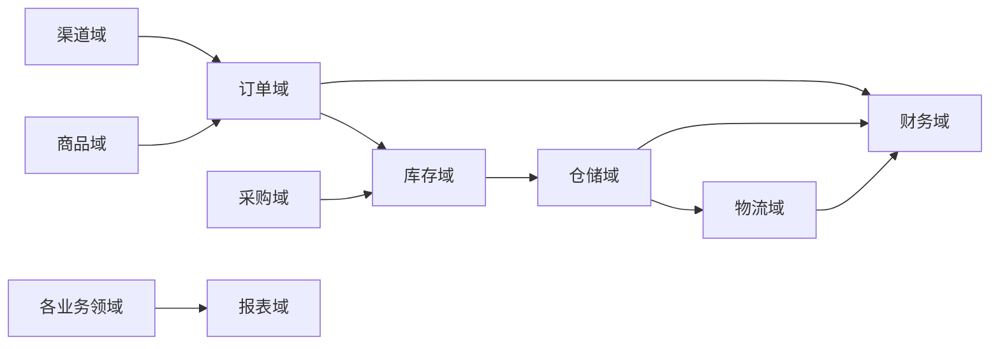
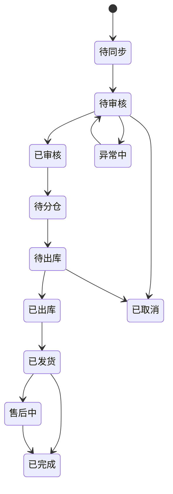
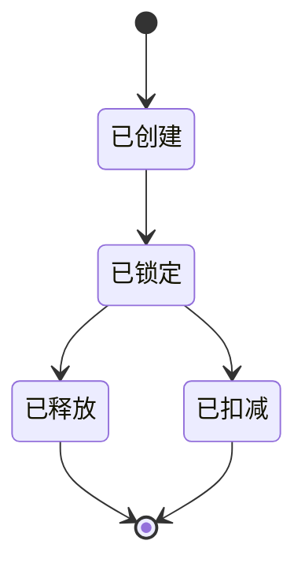
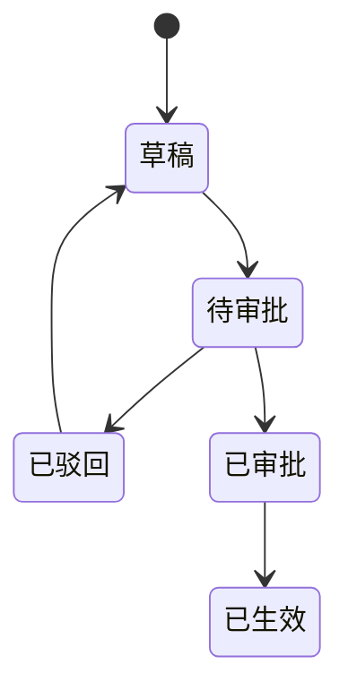
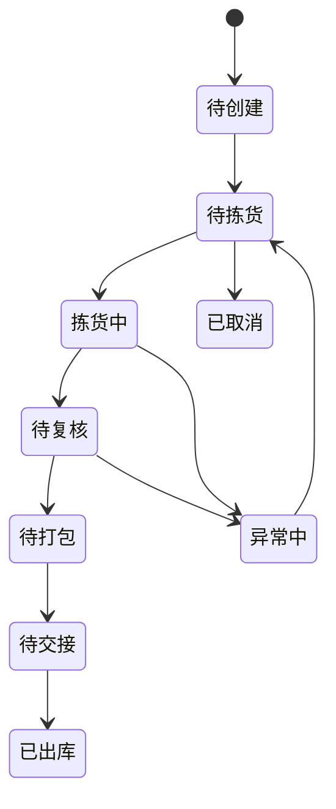

# 领域模型设计

## 1. 设计目标

本文档按面向对象设计和领域驱动设计方法，对跨境 ERP 的核心领域进行建模。目标是让实现者在编码前明确对象职责、聚合边界、状态流转、业务规则和领域事件，避免把业务逻辑散落在控制器、数据库脚本或外部接口适配器中。

## 2. 领域划分



领域边界：

| 领域 | 关注点 |
| --- | --- |
| 商品域 | 商品主数据、SKU、平台映射、包装、申报信息 |
| 渠道域 | 平台店铺、授权、同步任务、外部 API 调用 |
| 订单域 | 销售订单、订单审核、异常、售后、退款、补发 |
| 库存域 | 库存余额、库存锁定、库存流水、调拨、盘点 |
| 仓储域 | 入库、上架、波次、拣货、复核、打包、出库 |
| 物流域 | 物流商、渠道匹配、面单、发运、轨迹、运费 |
| 采购域 | 供应商、采购计划、采购单、到货、质检、退货 |
| 财务域 | 应收应付、结算、成本、汇率、利润 |
| 报表域 | 指标模型、聚合数据、经营分析 |

## 3. 通用值对象

| 值对象 | 属性 | 设计说明 |
| --- | --- | --- |
| 金额 | 币种、原币金额、本位币金额、汇率、汇率时间 | 金额必须使用整数最小货币单位或高精度 decimal，不允许浮点数 |
| 地址 | 国家、省州、城市、邮编、地址一、地址二、联系人、电话 | 用于订单、物流、供应商、仓库，必须支持脱敏 |
| 重量 | 数值、单位 | 支持克、千克、磅、盎司，物流计费前统一换算 |
| 尺寸 | 长、宽、高、单位 | 用于包裹、商品包装和体积重计算 |
| 时间范围 | 开始时间、结束时间、时区 | 用于报表、账期、活动和任务调度 |
| 单号 | 类型、日期、序列、租户 | 统一表达业务单据编号 |
| 外部引用 | 来源系统、外部 ID、外部类型、原始摘要 | 用于平台订单号、物流单号、海外仓单号 |

## 4. 商品域模型

### 4.1 聚合与对象

| 对象 | 类型 | 职责 |
| --- | --- | --- |
| 商品 | 聚合根 | 管理 SPU 基础信息、状态、类目、品牌 |
| SKU | 实体 | 表达可采购、可销售、可库存管理的最小商品单元 |
| SKU 变体 | 实体 | 表达颜色、尺寸、款式等变体属性 |
| 组合商品 | 聚合根或实体 | 管理套装 SKU 与子 SKU 的数量关系 |
| 平台 SKU 映射 | 实体 | 维护店铺 SKU、平台 SKU、ASIN、FNSKU 与内部 SKU 的关系 |
| 包装规格 | 值对象 | 维护商品长宽高、重量、包装材料 |
| 申报信息 | 值对象 | 维护 HS Code、申报名称、材质、用途、申报价值 |

### 4.2 关键规则

- 内部 SKU 是库存、采购、仓储和财务成本核算的唯一主业务标识。
- 同一个平台 SKU 在同一店铺内只能映射到一个有效内部 SKU 或一个组合 SKU。
- 组合商品不能形成循环引用。
- SKU 禁用后不能新增采购和销售，但历史订单、库存流水、财务流水必须保留。
- 商品申报信息变更必须记录版本，避免影响已发货订单的历史追溯。

### 4.3 领域事件

| 事件 | 触发条件 |
| --- | --- |
| 商品已创建 | 新商品创建成功 |
| SKU 已创建 | 新内部 SKU 创建成功 |
| SKU 已停用 | SKU 被停用 |
| 平台 SKU 映射已变更 | 店铺 SKU、平台 SKU、ASIN 或 FNSKU 映射发生变化 |
| 商品包装规格已变更 | 包装重量或尺寸变更 |

## 5. 渠道域模型

### 5.1 聚合与对象

| 对象 | 类型 | 职责 |
| --- | --- | --- |
| 平台 | 实体 | 表达 Amazon、Shopify、eBay、Walmart 等平台类型 |
| 店铺 | 聚合根 | 管理店铺信息、授权状态、销售站点、默认仓库 |
| 店铺授权 | 实体 | 管理 Token、授权范围、过期时间、刷新状态 |
| 同步任务 | 聚合根 | 管理订单、商品、库存、结算等同步任务 |
| API 调用日志 | 实体 | 保存平台 API 调用摘要、耗时、错误码和重试信息 |
| 平台适配器 | 接口 | 屏蔽不同平台的签名、限流、分页、错误码和数据结构 |

### 5.2 接口抽象

平台适配器按能力拆分，不设计“大而全”的平台接口：

| 接口 | 职责 |
| --- | --- |
| 订单连接器 | 拉取订单、获取订单详情、同步退货 |
| 商品连接器 | 拉取刊登、同步平台 SKU、更新价格 |
| 库存连接器 | 查询平台库存、推送可售库存 |
| 发货连接器 | 回传运单号、发货时间和物流商 |
| 结算连接器 | 创建结算报告、下载报告、解析结算文件 |

### 5.3 关键规则

- 店铺授权失效不能影响已入库订单处理，但必须暂停新的平台同步任务。
- 外部订单以店铺 ID + 平台订单号作为幂等键。
- 平台 API 必须经过限流器，不能由业务服务直接调用。
- 平台返回的原始数据要保存摘要或归档文件，便于排错和审计。

## 6. 订单域模型

### 6.1 聚合与对象

| 对象 | 类型 | 职责 |
| --- | --- | --- |
| 销售订单 | 聚合根 | 控制订单主状态、审核、取消、发货、完成 |
| 订单明细 | 实体 | 表达 SKU、数量、售价、折扣、税费 |
| 订单地址 | 值对象 | 表达收货地址和联系人信息 |
| 订单支付 | 值对象或实体 | 表达支付方式、币种、金额、平台交易号 |
| 订单异常 | 实体 | 表达缺货、地址错误、风控失败、利润异常 |
| 售后单 | 聚合根 | 管理退款、退货、补发、换货 |
| 订单状态历史 | 实体 | 记录状态流转和操作人 |

### 6.2 状态机



### 6.3 关键规则

- 销售订单创建必须幂等。
- 订单审核通过后才能申请库存锁定。
- 已出库订单不能直接取消，只能走拦截、退货或售后流程。
- 订单地址变更必须重新进行物流可达性校验。
- 订单金额、折扣、税费和平台佣金必须保留原币金额。
- 拆单后原订单保留父子关系，不能丢失平台订单引用。

### 6.4 领域服务

| 领域服务 | 职责 |
| --- | --- |
| 订单审核服务 | 校验地址、黑名单、库存、物流、利润和平台状态 |
| 拆单服务 | 按仓库、SKU、库存、物流限制拆分订单 |
| 售后判定服务 | 判断退款、退货、补发、换货的可执行条件 |
| 订单异常服务 | 识别并归类异常订单，生成处理建议 |

## 7. 库存域模型

### 7.1 聚合与对象

| 对象 | 类型 | 职责 |
| --- | --- | --- |
| 库存余额 | 聚合根 | 控制 SKU 在仓库、库位、批次、状态维度的数量 |
| 库存流水 | 实体 | 记录每次库存变化的来源、方向、数量和结果 |
| 库存锁定 | 聚合根 | 记录订单对库存的占用、释放和扣减 |
| 库存批次 | 实体 | 管理批次号、生产日期、有效期、成本 |
| 调拨单 | 聚合根 | 管理跨仓或库内调拨 |
| 盘点单 | 聚合根 | 管理盘点任务、盘盈、盘亏和调整 |
| 库存调整单 | 聚合根 | 管理人工库存调整及审批 |

### 7.2 库存数量关系

```text
实物库存 = 可售库存 + 锁定库存 + 冻结库存 + 次品库存
可销售库存 = 可售库存 - 安全库存 - 渠道预留库存
可承诺库存 = 可销售库存 + 可用在途库存 - 未释放锁定库存
```

### 7.3 关键规则

- 库存余额只能由库存服务修改。
- 所有库存变化必须写库存流水。
- 库存锁定、释放、扣减必须支持幂等。
- 扣减库存必须基于已锁定库存，禁止绕过锁定直接扣减销售库存。
- 盘点调整必须通过盘点单或调整单，不能直接改余额。
- 库存流水可以重算余额，余额表不能作为唯一事实来源。

### 7.4 状态机

库存锁定状态：



库存调整状态：



## 8. 仓储域模型

### 8.1 聚合与对象

| 对象 | 类型 | 职责 |
| --- | --- | --- |
| 仓库 | 聚合根 | 管理仓库基础信息、类型、时区、作业策略 |
| 库区 | 实体 | 管理仓库中的功能分区 |
| 库位 | 实体 | 管理具体存储位置、容量、状态 |
| 入库单 | 聚合根 | 控制收货、质检、上架流程 |
| 出库单 | 聚合根 | 控制拣货、复核、打包、称重、出库流程 |
| 波次 | 聚合根 | 管理订单批量拣货策略 |
| 拣货任务 | 实体 | 表达具体拣货动作 |
| 复核任务 | 实体 | 表达复核动作和结果 |
| 打包任务 | 实体 | 表达包裹、包装、称重和面单 |

### 8.2 出库状态机



### 8.3 关键规则

- 仓储服务不判断商品是否可售，只执行库存服务确认后的作业。
- PDA 扫码动作必须幂等，重复扫码不能重复扣减或重复完成任务。
- 拣货、复核、打包必须支持异常上报。
- 出库完成事件是库存扣减和订单发货的关键触发点。
- 面单可以来自 TMS，也可以先人工录入，后续再补全物流信息。

## 9. 物流域模型

### 9.1 聚合与对象

| 对象 | 类型 | 职责 |
| --- | --- | --- |
| 物流商 | 聚合根 | 管理物流商账号、接口配置、服务状态 |
| 物流产品 | 实体 | 表达渠道、时效、国家限制、重量限制 |
| 物流规则 | 聚合根 | 按目的国、邮编、重量、体积、商品属性匹配物流产品 |
| 发运单 | 聚合根 | 控制包裹、面单、运单号、发货状态 |
| 包裹 | 实体 | 表达包裹重量、尺寸、商品明细 |
| 面单 | 值对象或实体 | 表达面单文件、格式、版本和打印状态 |
| 轨迹事件 | 实体 | 表达物流节点、时间、地点和状态 |

### 9.2 关键规则

- 物流规则匹配必须可解释，保存命中的规则和原因。
- 面单获取失败不能自动取消出库单，应进入待处理状态。
- 轨迹事件按运单号、事件时间、事件编码幂等入库。
- 物流费用可以先预估，后续以账单导入金额为准。
- 禁运品、超尺寸、偏远地区必须在物流匹配阶段拦截。

## 10. 采购域模型

### 10.1 聚合与对象

| 对象 | 类型 | 职责 |
| --- | --- | --- |
| 供应商 | 聚合根 | 管理供应商档案、账期、等级和联系人 |
| 采购计划 | 聚合根 | 根据销售、库存、在途和安全库存生成采购建议 |
| 采购单 | 聚合根 | 管理采购下单、审核、到货、关闭 |
| 采购明细 | 实体 | 表达 SKU、数量、单价、交期 |
| 到货通知 | 聚合根 | 通知仓库准备收货 |
| 质检单 | 聚合根 | 管理合格、不合格、让步接收和退货 |
| 采购退货单 | 聚合根 | 管理不合格品退回供应商 |

### 10.2 关键规则

- 采购单审核后才能生成到货通知。
- 采购入库以 WMS 质检和上架结果为准。
- 采购成本进入库存成本前必须记录币种、税费、运费和汇率。
- 供应商交付质量和准时率要可统计。

## 11. 财务域模型

### 11.1 聚合与对象

| 对象 | 类型 | 职责 |
| --- | --- | --- |
| 应收单 | 聚合根 | 管理订单、平台结算、客户应收 |
| 应付单 | 聚合根 | 管理采购、物流、仓储、平台费用应付 |
| 平台结算 | 聚合根 | 管理平台回款、佣金、退款、调整项 |
| 成本分摊 | 领域服务 | 分摊采购、头程、仓储、尾程、广告等成本 |
| 汇率 | 值对象或实体 | 管理币种汇率、来源和生效时间 |
| 财务流水 | 实体 | 记录所有财务变更 |
| 利润核算结果 | 聚合根 | 保存订单、SKU、店铺、国家维度利润 |

### 11.2 关键规则

- 财务流水只追加，不覆盖。
- 汇率必须保存使用时点。
- 平台结算导入后必须匹配订单、退款、广告费、佣金和调整项。
- 利润重算必须保存计算版本，不能覆盖历史结果。
- 财务调整必须通过调整单或冲销单。

## 12. 报表域模型

报表域不直接作为交易事实来源。它通过领域事件、数据同步或 CDC 构建分析模型。

核心指标：

| 指标 | 来源 |
| --- | --- |
| 销售额、订单量、客单价 | 订单服务、渠道服务 |
| 缺货率、库存周转 | 库存服务 |
| 出库及时率、拣货效率 | WMS 仓储服务 |
| 妥投率、物流时效、异常率 | TMS 物流服务 |
| 采购到货准时率 | 采购服务 |
| 订单利润、SKU 利润、店铺利润 | 财务服务 |

## 13. 实现指导

- 控制器只做协议转换，不写业务规则。
- 应用服务负责编排用例、事务和外部依赖。
- 领域对象封装业务不变量和状态流转。
- 仓储接口只表达领域需要，不泄露 SQL 细节。
- 外部平台和物流商全部通过适配器实现。
- 每个聚合根都应有清晰的创建、变更、校验、状态流转和事件发布方法。
- 每个状态机都应有测试覆盖非法流转。

